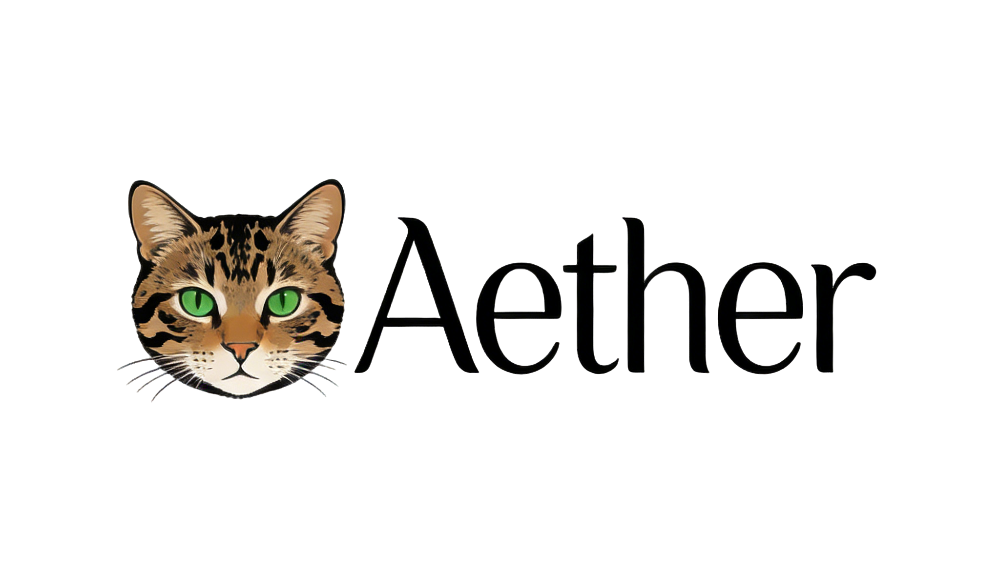

<div align="center">
  
  <h1>nanobot: Ultra-Lightweight Personal AI Assistant</h1>
  <p>
    <a href="https://pypi.org/project/nanobot-ai/"></a>
    <a href="https://pepy.tech/project/nanobot-ai"></a>
    
    
    <a href="./COMMUNICATION.md"></a>
    <a href="./COMMUNICATION.md"></a>
    <a href="https://discord.gg/MnCvHqpUGB"></a>
  </p>
</div>

🐈 **Aether** is an **ultra-lightweight** personal AI assistant designed for **resource-constrained edge AI environments**， comes from @https://github.com/HKUDS/nanobot

⚡️ Delivers core agent functionality in just **~4,000** lines of code — **99% smaller** than Clawdbot's 430k+ lines.

📏 Real-time line count: **3,510 lines** (run `bash core_agent_lines.sh` to verify anytime)

## 🎯 Core Philosophy

nanobot is built for **edge AI scenarios** where computing resources are limited. It achieves powerful AI capabilities through:

- **Small Language Models (SLMs)**: Optimized for running on edge devices with limited CPU/memory
- **Retrieval-Augmented Generation (RAG)**: Enhanced knowledge retrieval using local vector databases
- **Reranking**: Intelligent result re-ranking for improved accuracy
- **Local Embedding Models**: Text vectorization without external API dependencies
- **Efficient Architecture**: Minimal footprint for fast startup and low resource consumption

## 📢 News

- **2026-02-10** 🎉 Released v0.1.3.post6 with improvements! Check the updates [notes](https://github.com/HKUDS/nanobot/releases/tag/v0.1.3.post6) and our [roadmap](https://github.com/HKUDS/nanobot/discussions/431).
- **2026-02-09** 💬 Added Slack, Email, and QQ support — nanobot now supports multiple chat platforms!
- **2026-02-08** 🔧 Refactored Providers—adding a new LLM provider now takes just 2 simple steps! Check [here](#providers).
- **2026-02-07** 🚀 Released v0.1.3.post5 with Qwen support & several key improvements! Check [here](https://github.com/HKUDS/nanobot/releases/tag/v0.1.3.post5) for details.
- **2026-02-06** ✨ Added Moonshot/Kimi provider, Discord integration, and enhanced security hardening!
- **2026-02-05** ✨ Added Feishu channel, DeepSeek provider, and enhanced scheduled tasks support!
- **2026-02-04** 🚀 Released v0.1.3.post4 with multi-provider & Docker support! Check [here](https://github.com/HKUDS/nanobot/releases/tag/v0.1.3.post4) for details.
- **2026-02-03** ⚡ Integrated vLLM for local LLM support and improved natural language task scheduling!
- **2026-02-02** 🎉 nanobot officially launched! Welcome to try 🐱 nanobot!

## Key Features of nanobot:

🪶 **Ultra-Lightweight**: Just ~4,000 lines of core agent code — 99% smaller than Clawdbot.

🔬 **Research-Ready**: Clean, readable code that's easy to understand, modify, and extend for research.

⚡️ **Lightning Fast**: Minimal footprint means faster startup, lower resource usage, and quicker iterations.

💎 **Easy-to-Use**: One-click to deploy and you're ready to go.

🧠 **Edge-Optimized**: Designed specifically for resource-constrained environments with efficient RAG and local models.

📚 **RAG-Powered**: Built-in retrieval-augmented generation using Chroma vector database and local embeddings.

## 🧠 Technical Capabilities for Edge AI

### Small Model Optimization

nanobot is designed to work efficiently with small language models (SLMs):

- **Local Model Support**: Run with vLLM, Ollama, or any OpenAI-compatible server
- **Resource Efficiency**: Optimized for low-memory environments (Edge devices, IoT)
- **Flexible Model Selection**: Support for multiple SLM providers (Qwen, Llama, DeepSeek, etc.)

### RAG (Retrieval-Augmented Generation)

Enhance model capabilities with domain-specific knowledge:

- **Vector Database**: Chroma-based local storage for embeddings
- **Local Embeddings**: Use sentence-transformers models (e.g., BAAI/bge-large-zh-v1.5) without API calls
- **Semantic Search**: Find relevant knowledge based on meaning, not just keywords
- **Smart Chunking**: Automatic text segmentation for optimal retrieval
- **Domain Knowledge**: Built-in RocketMQ troubleshooting guides and best practices

### Reranking System

Improve retrieval accuracy with intelligent re-ranking:

- **CrossEncoder**: Advanced reranking model for result refinement
- **Similarity Thresholding**: Filter low-quality results
- **Configurable**: Adjust rerank model and threshold to balance accuracy vs. speed

### Efficient Knowledge Management

- **Auto-Initialization**: Automatically load built-in knowledge on first run
- **Incremental Updates**: Add/modify/delete knowledge without full re-indexing
- **Multi-Domain Support**: Organize knowledge by domain (rocketmq, kubernetes, etc.)
- **Category & Tags**: Structured knowledge with rich metadata
- **Local Storage**: All data stored locally — no external dependencies

### Performance Optimizations

- **Batch Processing**: Efficient batch vectorization
- **Lazy Loading**: Load embedding models only when needed
- **Caching**: Smart caching to reduce redundant computations
- **Async Operations**: Non-blocking initialization and queries

## 🏗️ Architecture

<p align="center">
  
</p>

## ✨ Features

<table align="center">
  <tr align="center">
    <th><p align="center">📈 24/7 Real-Time Market Analysis</p></th>
    <th><p align="center">🚀 Full-Stack Software Engineer</p></th>
    <th><p align="center">📅 Smart Daily Routine Manager</p></th>
    <th><p align="center">📚 Personal Knowledge Assistant</p></th>
  </tr>
  <tr>
    <td align="center"><p align="center"></p></td>
    <td align="center"><p align="center"></p></td>
    <td align="center"><p align="center"></p></td>
    <td align="center"><p align="center"></p></td>
  </tr>
  <tr>
    <td align="center">Discovery • Insights • Trends</td>
    <td align="center">Develop • Deploy • Scale</td>
    <td align="center">Schedule • Automate • Organize</td>
    <td align="center">Learn • Memory • Reasoning</td>
  </tr>
</table>

## 📦 Install

**Install from source** (latest features, recommended for development)

```bash
git clone https://github.com/HKUDS/nanobot.git
cd nanobot
pip install -e .
```

**Install with [uv](https://github.com/astral-sh/uv)** (stable, fast)

```bash
uv tool install nanobot-ai
```

**Install from PyPI** (stable)

```bash
pip install nanobot-ai
```

## 🚀 Quick Start

> [!TIP]
> Set your API key in `~/.nanobot/config.json`.
> Get API keys: [OpenRouter](https://openrouter.ai/keys) (Global) · [Brave Search](https://brave.com/search/api/) (optional, for web search)

**1. Initialize**

```bash
nanobot onboard
```

**2. Configure** (`~/.nanobot/config.json`)

For OpenRouter - recommended for global users:
```json
{
  "providers": {
    "openrouter": {
      "apiKey": "sk-or-v1-xxx"
    }
  },
  "agents": {
    "defaults": {
      "model": "anthropic/claude-opus-4-5"
    }
  }
}
```

**3. Chat**

```bash
nanobot agent -m "What is 2+2?"
```

That's it! You have a working AI assistant in 2 minutes.

## 🖥️ Local Models (vLLM)

Run nanobot with your own local models using vLLM or any OpenAI-compatible server.

**1. Start your vLLM server**

```bash
vllm serve meta-llama/Llama-3.1-8B-Instruct --port 8000
```

**2. Configure** (`~/.nanobot/config.json`)

```json
{
  "providers": {
    "vllm": {
      "apiKey": "dummy",
      "apiBase": "http://localhost:8000/v1"
    }
  },
  "agents": {
    "defaults": {
      "model": "meta-llama/Llama-3.1-8B-Instruct"
    }
  }
}
```

**3. Chat**

```bash
nanobot agent -m "Hello from my local LLM!"
```

## 🖥️ Local Models (Ollama)

Run nanobot with Ollama - a popular local LLM deployment tool.

**1. Start your Ollama server**

```bash
# Install Ollama first if not installed
# Visit https://ollama.ai/download for installation instructions

# Pull a model
ollama pull llama3.1

# Ollama server runs automatically on http://localhost:11434
```

**2. Configure** (`~/.nanobot/config.json`)

```json
{
  "providers": {
    "ollama": {
      "apiKey": "dummy",
      "apiBase": "http://localhost:11434"
    }
  },
  "agents": {
    "defaults": {
      "model": "llama3.1"
    }
  }
}
```

**3. Chat**

```bash
nanobot agent -m "Hello from my Ollama LLM!"
```

> [!TIP]
> The `apiKey` can be any non-empty string for local servers that don't require authentication.

## 💬 Chat Apps

Talk to your nanobot through Telegram, Discord, WhatsApp, Feishu, Mochat, DingTalk, Slack, Email, QQ, or WebUI — anytime, anywhere.

| Channel | Setup |
|---------|-------|
| **WebUI** | Easy (built-in web interface) |
| **Telegram** | Easy (just a token) |
| **Discord** | Easy (bot token + intents) |
| **WhatsApp** | Medium (scan QR) |
| **Feishu** | Medium (app credentials) |
| **Mochat** | Medium (claw token + websocket) |
| **DingTalk** | Medium (app credentials) |
| **Slack** | Medium (bot + app tokens) |
| **Email** | Medium (IMAP/SMTP credentials) |
| **QQ** | Easy (app credentials) |

<details>
<summary><b>WebUI</b> (Built-in Web Interface)</summary>

nanobot includes a **built-in web interface** that provides a modern, responsive chat experience accessible from any browser.

**1. Start the WebUI server**

```bash
# Start the web interface on port 8000 (default)
nanobot webui

# Or specify a custom port
nanobot webui --port 8080

# Start with debug mode for development
nanobot webui --debug
```

**2. Access the WebUI**

Open your browser and navigate to:
- **Local**: http://localhost:8000
- **Custom port**: http://localhost:8080 (if using --port)

**3. Configure (optional)**

Add WebUI-specific settings to `~/.nanobot/config.json`:

```json
{
  "webui": {
    "enabled": true,
    "port": 8000,
    "host": "0.0.0.0",
    "debug": false,
    "cors_origins": ["http://localhost:3000", "https://your-domain.com"]
  }
}
```

**4. Features**

- 🎨 **Modern Interface**: Clean, responsive design that works on desktop and mobile
- 💬 **Real-time Chat**: WebSocket-based real-time messaging with typing indicators
- 📱 **Mobile Friendly**: Optimized for mobile devices
- 🔄 **Streaming Responses**: Watch responses stream in real-time
- 📋 **Copy & Share**: Easy copy buttons for messages
- 🌙 **Dark/Light Mode**: Automatic theme switching based on system preferences
- 🔒 **Session Management**: Persistent chat sessions with history

**5. Docker Usage**

When running nanobot in Docker, expose the WebUI port:

```bash
docker run -v ~/.nanobot:/root/.nanobot -p 8000:8000 nanobot webui
```

**6. Development Mode**

For development, start with hot reload:

```bash
# Install development dependencies
pip install -e ".[dev]"

# Start with auto-reload
nanobot webui --debug --reload
```

**7. API Endpoints**

The WebUI also exposes a REST API for programmatic access:

- `GET /api/health` - Health check
- `POST /api/chat` - Send message to agent
- `GET /api/sessions` - List chat sessions
- `GET /api/sessions/{session_id}` - Get session history

**Example API Usage:**

```bash
# Send a message via API
curl -X POST http://localhost:8000/api/chat \
  -H "Content-Type: application/json" \
  -d '{"message": "Hello nanobot!", "session_id": "optional-session-id"}'
```

</details>

<details>
<summary><b>Telegram</b> (Recommended)</summary>

**1. Create a bot**
- Open Telegram, search `@BotFather`
- Send `/newbot`, follow prompts
- Copy the token

**2. Configure**

```json
{
  "channels": {
    "telegram": {
      "enabled": true,
      "token": "YOUR_BOT_TOKEN",
      "allowFrom": ["YOUR_USER_ID"]
    }
  }
}
```

> You can find your **User ID** in Telegram settings. It is shown as `@yourUserId`.
> Copy this value **without the `@` symbol** and paste it into the config file.


**3. Run**

```bash
nanobot gateway
```

</details>

<details>
<summary><b>Mochat (Claw IM)</b></summary>

Uses **Socket.IO WebSocket** by default, with HTTP polling fallback.

**1. Ask nanobot to set up Mochat for you**

Simply send this message to nanobot (replace `xxx@xxx` with your real email):

```
Read https://raw.githubusercontent.com/HKUDS/MoChat/refs/heads/main/skills/nanobot/skill.md and register on MoChat. My Email account is xxx@xxx Bind me as your owner and DM me on MoChat.
```

nanobot will automatically register, configure `~/.nanobot/config.json`, and connect to Mochat.

**2. Restart gateway**

```bash
nanobot gateway
```

That's it — nanobot handles the rest!

<br>

<details>
<summary>Manual configuration (advanced)</summary>

If you prefer to configure manually, add the following to `~/.nanobot/config.json`:

> Keep `claw_token` private. It should only be sent in `X-Claw-Token` header to your Mochat API endpoint.

```json
{
  "channels": {
    "mochat": {
      "enabled": true,
      "base_url": "https://mochat.io",
      "socket_url": "https://mochat.io",
      "socket_path": "/socket.io",
      "claw_token": "claw_xxx",
      "agent_user_id": "6982abcdef",
      "sessions": ["*"],
      "panels": ["*"],
      "reply_delay_mode": "non-mention",
      "reply_delay_ms": 120000
    }
  }
}
```


</details>

</details>

<details>
<summary><b>Discord</b></summary>

**1. Create a bot**
- Go to https://discord.com/developers/applications
- Create an application → Bot → Add Bot
- Copy the bot token

**2. Enable intents**
- In the Bot settings, enable **MESSAGE CONTENT INTENT**
- (Optional) Enable **SERVER MEMBERS INTENT** if you plan to use allow lists based on member data

**3. Get your User ID**
- Discord Settings → Advanced → enable **Developer Mode**
- Right-click your avatar → **Copy User ID**

**4. Configure**

```json
{
  "channels": {
    "discord": {
      "enabled": true,
      "token": "YOUR_BOT_TOKEN",
      "allowFrom": ["YOUR_USER_ID"]
    }
  }
}
```

**5. Invite the bot**
- OAuth2 → URL Generator
- Scopes: `bot`
- Bot Permissions: `Send Messages`, `Read Message History`
- Open the generated invite URL and add the bot to your server

**6. Run**

```bash
nanobot gateway
```

</details>

<details>
<summary><b>WhatsApp</b></summary>

Requires **Node.js ≥18**.

**1. Link device**

```bash
nanobot channels login
# Scan QR with WhatsApp → Settings → Linked Devices
```

**2. Configure**

```json
{
  "channels": {
    "whatsapp": {
      "enabled": true,
      "allowFrom": ["+1234567890"]
    }
  }
}
```

**3. Run** (two terminals)

```bash
# Terminal 1
nanobot channels login

# Terminal 2
nanobot gateway
```

</details>

<details>
<summary><b>Feishu (飞书)</b></summary>

Uses **WebSocket** long connection — no public IP required.

**1. Create a Feishu bot**
- Visit [Feishu Open Platform](https://open.feishu.cn/app)
- Create a new app → Enable **Bot** capability
- **Permissions**: Add `im:message` (send messages)
- **Events**: Add `im.message.receive_v1` (receive messages)
  - Select **Long Connection** mode (requires running nanobot first to establish connection)
- Get **App ID** and **App Secret** from "Credentials & Basic Info"
- Publish the app

**2. Configure**

```json
{
  "channels": {
    "feishu": {
      "enabled": true,
      "appId": "cli_xxx",
      "appSecret": "xxx",
      "encryptKey": "",
      "verificationToken": "",
      "allowFrom": []
    }
  }
}
```

> `encryptKey` and `verificationToken` are optional for Long Connection mode.
> `allowFrom`: Leave empty to allow all users, or add `["ou_xxx"]` to restrict access.

**3. Run**

```bash
nanobot gateway
```

> [!TIP]
> Feishu uses WebSocket to receive messages — no webhook or public IP needed!

</details>

<details>
<summary><b>QQ (QQ单聊)</b></summary>

Uses **botpy SDK** with WebSocket — no public IP required. Currently supports **private messages only**.

**1. Register & create bot**
- Visit [QQ Open Platform](https://q.qq.com) → Register as a developer (personal or enterprise)
- Create a new bot application
- Go to **开发设置 (Developer Settings)** → copy **AppID** and **AppSecret**

**2. Set up sandbox for testing**
- In the bot management console, find **沙箱配置 (Sandbox Config)**
- Under **在消息列表配置**, click **添加成员** and add your own QQ number
- Once added, scan the bot's QR code with mobile QQ → open the bot profile → tap "发消息" to start chatting

**3. Configure**

> - `allowFrom`: Leave empty for public access, or add user openids to restrict. You can find openids in the nanobot logs when a user messages the bot.
> - For production: submit a review in the bot console and publish. See [QQ Bot Docs](https://bot.q.qq.com/wiki/) for the full publishing flow.

```json
{
  "channels": {
    "qq": {
      "enabled": true,
      "appId": "YOUR_APP_ID",
      "secret": "YOUR_APP_SECRET",
      "allowFrom": []
    }
  }
}
```

**4. Run**

```bash
nanobot gateway
```

Now send a message to the bot from QQ — it should respond!

</details>

<details>
<summary><b>DingTalk (钉钉)</b></summary>

Uses **Stream Mode** — no public IP required.

**1. Create a DingTalk bot**
- Visit [DingTalk Open Platform](https://open-dev.dingtalk.com/)
- Create a new app -> Add **Robot** capability
- **Configuration**:
  - Toggle **Stream Mode** ON
- **Permissions**: Add necessary permissions for sending messages
- Get **AppKey** (Client ID) and **AppSecret** (Client Secret) from "Credentials"
- Publish the app

**2. Configure**

```json
{
  "channels": {
    "dingtalk": {
      "enabled": true,
      "clientId": "YOUR_APP_KEY",
      "clientSecret": "YOUR_APP_SECRET",
      "allowFrom": []
    }
  }
}
```

> `allowFrom`: Leave empty to allow all users, or add `["staffId"]` to restrict access.

**3. Run**

```bash
nanobot gateway
```

</details>

<details>
<summary><b>Slack</b></summary>

Uses **Socket Mode** — no public URL required.

**1. Create a Slack app**
- Go to [Slack API](https://api.slack.com/apps) → **Create New App** → "From scratch"
- Pick a name and select your workspace

**2. Configure the app**
- **Socket Mode**: Toggle ON → Generate an **App-Level Token** with `connections:write` scope → copy it (`xapp-...`)
- **OAuth & Permissions**: Add bot scopes: `chat:write`, `reactions:write`, `app_mentions:read`
- **Event Subscriptions**: Toggle ON → Subscribe to bot events: `message.im`, `message.channels`, `app_mention` → Save Changes
- **App Home**: Scroll to **Show Tabs** → Enable **Messages Tab** → Check **"Allow users to send Slash commands and messages from the messages tab"**
- **Install App**: Click **Install to Workspace** → Authorize → copy the **Bot Token** (`xoxb-...`)

**3. Configure nanobot**

```json
{
  "channels": {
    "slack": {
      "enabled": true,
      "botToken": "xoxb-...",
      "appToken": "xapp-...",
      "groupPolicy": "mention"
    }
  }
}
```

**4. Run**

```bash
nanobot gateway
```

DM the bot directly or @mention it in a channel — it should respond!

> [!TIP]
> - `groupPolicy`: `"mention"` (default — respond only when @mentioned), `"open"` (respond to all channel messages), or `"allowlist"` (restrict to specific channels).
> - DM policy defaults to open. Set `"dm": {"enabled": false}` to disable DMs.

</details>

<details>
<summary><b>Email</b></summary>

Give nanobot its own email account. It polls **IMAP** for incoming mail and replies via **SMTP** — like a personal email assistant.

**1. Get credentials (Gmail example)**
- Create a dedicated Gmail account for your bot (e.g. `my-nanobot@gmail.com`)
- Enable 2-Step Verification → Create an [App Password](https://myaccount.google.com/apppasswords)
- Use this app password for both IMAP and SMTP

**2. Configure**

> - `consentGranted` must be `true` to allow mailbox access. This is a safety gate — set `false` to fully disable.
> - `allowFrom`: Leave empty to accept emails from anyone, or restrict to specific senders.
> - `smtpUseTls` and `smtpUseSsl` default to `true` / `false` respectively, which is correct for Gmail (port 587 + STARTTLS). No need to set them explicitly.
> - Set `"autoReplyEnabled": false` if you only want to read/analyze emails without sending automatic replies.

```json
{
  "channels": {
    "email": {
      "enabled": true,
      "consentGranted": true,
      "imapHost": "imap.gmail.com",
      "imapPort": 993,
      "imapUsername": "my-nanobot@gmail.com",
      "imapPassword": "your-app-password",
      "smtpHost": "smtp.gmail.com",
      "smtpPort": 587,
      "smtpUsername": "my-nanobot@gmail.com",
      "smtpPassword": "your-app-password",
      "fromAddress": "my-nanobot@gmail.com",
      "allowFrom": ["your-real-email@gmail.com"]
    }
  }
}
```


**3. Run**

```bash
nanobot gateway
```

</details>

## ⚙️ Configuration

Config file: `~/.nanobot/config.json`

### Providers

> [!TIP]
> - **Groq** provides free voice transcription via Whisper. If configured, Telegram voice messages will be automatically transcribed.
> - **Zhipu Coding Plan**: If you're on Zhipu's coding plan, set `"apiBase": "https://open.bigmodel.cn/api/coding/paas/v4"` in your zhipu provider config.
> - **MiniMax (Mainland China)**: If your API key is from MiniMax's mainland China platform (minimaxi.com), set `"apiBase": "https://api.minimaxi.com/v1"` in your minimax provider config.

| Provider | Purpose | Get API Key |
|----------|---------|-------------|
| `openrouter` | LLM (recommended, access to all models) | [openrouter.ai](https://openrouter.ai) |
| `anthropic` | LLM (Claude direct) | [console.anthropic.com](https://console.anthropic.com) |
| `openai` | LLM (GPT direct) | [platform.openai.com](https://platform.openai.com) |
| `deepseek` | LLM (DeepSeek direct) | [platform.deepseek.com](https://platform.deepseek.com) |
| `groq` | LLM + **Voice transcription** (Whisper) | [console.groq.com](https://console.groq.com) |
| `gemini` | LLM (Gemini direct) | [aistudio.google.com](https://aistudio.google.com) |
| `minimax` | LLM (MiniMax direct) | [platform.minimax.io](https://platform.minimax.io) |
| `aihubmix` | LLM (API gateway, access to all models) | [aihubmix.com](https://aihubmix.com) |
| `dashscope` | LLM (Qwen) | [dashscope.console.aliyun.com](https://dashscope.console.aliyun.com) |
| `moonshot` | LLM (Moonshot/Kimi) | [platform.moonshot.cn](https://platform.moonshot.cn) |
| `zhipu` | LLM (Zhipu GLM) | [open.bigmodel.cn](https://open.bigmodel.cn) |
| `vllm` | LLM (local, any OpenAI-compatible server) | — |
| `ollama` | LLM (local, Ollama server) | — |

<details>
<summary><b>Adding a New Provider (Developer Guide)</b></summary>

nanobot uses a **Provider Registry** (`nanobot/providers/registry.py`) as the single source of truth.
Adding a new provider only takes **2 steps** — no if-elif chains to touch.

**Step 1.** Add a provider specification entry to the providers registry:

```python
# In nanobot/providers/registry.py, add to the PROVIDERS list
PROVIDERS = [
    # ... existing providers ...
    {
        "name": "myprovider",                   # config field name
        "keywords": ("myprovider", "mymodel"),  # model-name keywords for auto-matching
        "env_key": "MYPROVIDER_API_KEY",        # env var for LiteLLM
        "display_name": "My Provider",          # shown in `nanobot status`
        "litellm_prefix": "myprovider",         # auto-prefix: model → myprovider/model
        "skip_prefixes": ("myprovider/",),      # don't double-prefix
    },
]
```

**Step 2.** Add a field to the providers configuration schema:

```python
# In nanobot/config/schema.py, add to the ProvidersConfig class
class ProvidersConfig:
    # ... existing provider fields ...
    myprovider: dict = {}  # Provider configuration
```

That's it! Environment variables, model prefixing, config matching, and `nanobot status` display will all work automatically.

**Common `ProviderSpec` options:**

| Field | Description | Example |
|-------|-------------|---------|
| `litellm_prefix` | Auto-prefix model names for LiteLLM | `"dashscope"` → `dashscope/qwen-max` |
| `skip_prefixes` | Don't prefix if model already starts with these | `("dashscope/", "openrouter/")` |
| `env_extras` | Additional env vars to set | `(("ZHIPUAI_API_KEY", "{api_key}"),)` |
| `model_overrides` | Per-model parameter overrides | `(("kimi-k2.5", {"temperature": 1.0}),)` |
| `is_gateway` | Can route any model (like OpenRouter) | `True` |
| `detect_by_key_prefix` | Detect gateway by API key prefix | `"sk-or-"` |
| `detect_by_base_keyword` | Detect gateway by API base URL | `"openrouter"` |
| `strip_model_prefix` | Strip existing prefix before re-prefixing | `True` (for AiHubMix) |

</details>


### Security

> For production deployments, set `"restrictToWorkspace": true` in your config to sandbox the agent.

| Option | Default | Description |
|--------|---------|-------------|
| `tools.restrictToWorkspace` | `false` | When `true`, restricts **all** agent tools (shell, file read/write/edit, list) to the workspace directory. Prevents path traversal and out-of-scope access. |
| `channels.*.allowFrom` | `[]` (allow all) | Whitelist of user IDs. Empty = allow everyone; non-empty = only listed users can interact. |

### MCP (Model Context Protocol)

> MCP allows nanobot to connect to external services and data sources through specialized servers.

| Option | Default | Description |
|--------|---------|-------------|
| `mcp.servers.*.enabled` | `false` | Enable/disable specific MCP servers |
| `mcp.servers.*.server_url` | `""` | URL of the MCP server |
| `mcp.servers.*.auth_token` | `""` | Authentication token for the MCP server |
| `mcp.auto_discover` | `true` | Automatically discover MCP servers |
| `mcp.discovery_path` | `~/.mcp/servers` | Path to look for MCP server configurations |

**Available MCP Tools:**

- `use_mcp_tool` - Call tools provided by connected MCP servers
- `mcp_knowledge_search` - Search knowledge bases via MCP servers

**Example Configuration:**

```json
{
  "mcp": {
    "servers": {
      "knowledge_server": {
        "enabled": true,
        "server_url": "http://localhost:8080",
        "auth_token": "your-auth-token-here"
      }
    }
  }
}
```


## CLI Reference

| Command | Description |
|---------|-------------|
| `nanobot onboard` | Initialize config & workspace |
| `nanobot agent -m "..."` | Chat with the agent |
| `nanobot agent` | Interactive chat mode |
| `nanobot agent --no-markdown` | Show plain-text replies |
| `nanobot agent --logs` | Show runtime logs during chat |
| `nanobot gateway` | Start the gateway |
| `nanobot status` | Show status |
| `nanobot channels login` | Link WhatsApp (scan QR) |
| `nanobot channels status` | Show channel status |

Interactive mode exits: `exit`, `quit`, `/exit`, `/quit`, `:q`, or `Ctrl+D`.

## Knowledge Base

> Local knowledge base system for storing and managing domain-specific knowledge, especially for RocketMQ troubleshooting and configuration guides.

### Available Knowledge Tools

- `knowledge_search` - Search the knowledge base for specific information
- `knowledge_add` - Add new knowledge entries to the knowledge base
- `knowledge_rocketmq` - Specialized RocketMQ knowledge management
- `knowledge_export` - Export knowledge base for backup

### RocketMQ Knowledge Support

The knowledge base includes specialized support for RocketMQ with:

- **Troubleshooting Guides**: Message sending failures, consumer group issues, network problems
- **Configuration Guides**: Broker configuration, performance tuning, best practices
- **Diagnostic Tools**: Topic validity checkers, consumer group validators

### Example Usage

```bash
# Run the RocketMQ knowledge demo
python examples/rocketmq_knowledge_demo.py

# Search for RocketMQ troubleshooting guides
nanobot agent -m "搜索RocketMQ消息发送失败的排查指南"

# Add new knowledge
nanobot agent -m "添加一条关于RocketMQ消费者组配置的知识"
```

<details>
<summary><b>Scheduled Tasks (Cron)</b></summary>

```bash
# Add a job
nanobot cron add --name "daily" --message "Good morning!" --cron "0 9 * * *"
nanobot cron add --name "hourly" --message "Check status" --every 3600

# List jobs
nanobot cron list

# Remove a job
nanobot cron remove <job_id>
```

</details>

## 🐳 Docker

> [!TIP]
> The `-v ~/.nanobot:/root/.nanobot` flag mounts your local config directory into the container, so your config and workspace persist across container restarts.

Build and run nanobot in a container:

```bash
# Build the image
docker build -t nanobot .

# Initialize config (first time only)
docker run -v ~/.nanobot:/root/.nanobot --rm nanobot onboard

# Edit config on host to add API keys
vim ~/.nanobot/config.json

# Run gateway (connects to enabled channels, e.g. Telegram/Discord/Mochat)
docker run -v ~/.nanobot:/root/.nanobot -p 18790:18790 nanobot gateway

# Or run a single command
docker run -v ~/.nanobot:/root/.nanobot --rm nanobot agent -m "Hello!"
docker run -v ~/.nanobot:/root/.nanobot --rm nanobot status
```

## 🔍 RAG Configuration

nanobot supports Retrieval-Augmented Generation (RAG) for knowledge base operations, specifically designed for edge AI environments with resource constraints. You can configure RAG parameters in `~/.nanobot/config.json` under the `agents.defaults` section:

```json
{
  "agents": {
    "defaults": {
      // ... existing agent configuration ...
      
      // RAG Configuration - Local embeddings, no external APIs
      "embedding_model": "~/.nanobot/models/models--BAAI--bge-large-zh-v1.5",
      "chunk_size": 500,
      "chunk_overlap": 100,
      "top_k": 5,
      "similarity_threshold": 0.0,
      "batch_size": 32,
      "timeout": 5,
      
      // Reranking configuration for improved accuracy
      "rerank_model_path": "",
      "rerank_threshold": 0.8
    }
  }
}
```

### RAG Configuration Parameters

- **embedding_model**: Path to local embedding model (e.g., BAAI/bge-large-zh-v1.5, paraphrase-multilingual-mpnet-base-v2)
- **chunk_size**: Text chunk size in characters (default: 500)
- **chunk_overlap**: Text chunk overlap size in characters (default: 100)
- **top_k**: Number of results to return in retrieval (default: 5)
- **similarity_threshold**: Minimum similarity score threshold (default: 0.0)
- **batch_size**: Batch size for vectorization operations (default: 32)
- **timeout**: Timeout in seconds for operations (default: 5)
- **rerank_model_path**: Path to CrossEncoder model for result reranking (optional)
- **rerank_threshold**: Threshold for reranking results (0.0-1.0, default: 0.8)

### Edge AI Benefits

This RAG system is optimized for edge environments:

- **Zero External API Calls**: All embeddings and reranking performed locally
- **Low Memory Footprint**: Efficient models designed for resource-constrained devices
- **Fast Startup**: Models loaded on-demand, minimal initialization overhead
- **Offline Capability**: Full functionality without internet connectivity
- **Privacy Preserving**: All knowledge and embeddings stored locally

For a complete example, see [rag_config_example.json](rag_config_example.json).

## 🔧 Edge AI Deployment Guide

### Local Models for Edge Devices

nanobot is designed to run on edge devices with limited resources:

#### Using Small Language Models (SLMs)

**Option 1: vLLM (Recommended for Edge Servers)**

```bash
# Install vLLM with quantization support
pip install vllm

# Start a small model server (e.g., Qwen-7B, Llama-3.1-8B)
vllm serve Qwen/Qwen2.5-7B-Instruct \
  --port 8000 \
  --quantization awq \  # Use AWQ/ GPTQ for memory efficiency
  --max-model-len 4096 \
  --tensor-parallel-size 1
```

**Option 2: Ollama (Recommended for Desktop/Edge AI)**

```bash
# Install Ollama
curl -fsSL https://ollama.ai/install.sh | sh

# Pull a small model optimized for edge devices
ollama pull qwen2.5:7b       # 7B parameter model
ollama pull llama3.1:8b       # 8B parameter model
ollama pull phi3:mini         # 3.8B parameter model (very lightweight)

# Configure nanobot
cat > ~/.nanobot/config.json << EOF
{
  "providers": {
    "ollama": {
      "apiKey": "dummy",
      "apiBase": "http://localhost:11434"
    }
  },
  "agents": {
    "defaults": {
      "model": "qwen2.5:7b"
    }
  }
}
EOF
```

#### Resource Requirements

| Model | RAM | Storage | Use Case |
|-------|-----|---------|----------|
| Phi-3 Mini (3.8B) | 4GB | 2GB | IoT devices, very limited resources |
| Qwen2.5-7B (Quantized) | 6GB | 4GB | Edge AI boxes, desktop |
| Llama-3.1-8B (Quantized) | 8GB | 5GB | Workstations, small servers |
| Qwen2.5-14B (Quantized) | 12GB | 9GB | Powerful edge servers |

#### Optimizing for Edge Environments

```json
{
  "agents": {
    "defaults": {
      "model": "qwen2.5:7b",
      "max_tokens": 2048,           // Reduce context size for memory efficiency
      "temperature": 0.5,           // Lower temperature for more deterministic outputs
      "max_tool_iterations": 5      // Limit iterations to reduce latency
    },
    "rag": {
      "chunk_size": 300,           // Smaller chunks for faster processing
      "chunk_overlap": 50,
      "top_k": 3,                  // Fewer results for speed
      "batch_size": 16,            // Smaller batches for memory efficiency
      "similarity_threshold": 0.7,  // Higher threshold for quality
      "rerank_threshold": 0.85     // Stricter reranking
    }
  }
}
```

### Offline Knowledge Management

nanobot's RAG system works completely offline:

1. **Prepare Knowledge Base**
   ```bash
   # Download pre-built knowledge or create your own
   nanobot knowledge import --from-file docs/knowledge.json
   ```

2. **Initialize Embeddings (One-time)**
   ```bash
   # First run will vectorize all knowledge (may take a few minutes)
   nanobot agent -m "Initialize knowledge base"
   ```

3. **Run Offline**
   ```bash
   # All subsequent queries use local embeddings and models
   nanobot gateway  # Start offline-capable agent
   ```

### Docker for Edge Deployment

```bash
# Build optimized edge image
docker build -t nanobot-edge .

# Run with minimal resources
docker run -d \
  --name nanobot \
  --memory=4g \
  --cpus=2 \
  -v ~/.nanobot:/root/.nanobot \
  -p 8000:8000 \
  nanobot-edge

# Monitor resource usage
docker stats nanobot
```

## 📁 Project Structure

```
nanobot/
├── agent/          # 🧠 Core agent logic (3,000+ lines)
│   ├── loop.py     #    Agent loop (LLM ↔ tool execution)
│   ├── context.py  #    Prompt builder
│   ├── memory.py   #    Persistent memory
│   ├── skills.py   #    Skills loader
│   ├── subagent.py #    Background task execution
│   └── tools/      #    Built-in tools (incl. spawn, knowledge)
├── knowledge/      # 📚 RAG knowledge base system
│   ├── store.py    #    Chroma vector database wrapper
│   ├── vector_embedder.py  # Local embedding models
│   ├── text_chunker.py      # Smart text chunking
│   ├── rag_config.py        # RAG configuration
│   └── rocketmq_init.py    # Built-in RocketMQ knowledge
├── skills/         # 🎯 Bundled skills (github, weather, tmux...)
├── channels/       # 📱 Chat channel integrations
├── bus/            # 🚌 Message routing
├── cron/           # ⏰ Scheduled tasks
├── heartbeat/      # 💓 Proactive wake-up
├── providers/      # 🤖 LLM providers (vLLM, Ollama, etc.)
├── session/        # 💬 Conversation sessions
├── config/         # ⚙️ Configuration
└── cli/            # 🖥️ Commands
```

## 🤝 Contribute & Roadmap

PRs welcome! The codebase is intentionally small and readable. 🤗

**Roadmap** — Pick an item and [open a PR](https://github.com/HKUDS/nanobot/pulls)!

- [x] **Voice Transcription** — Support for Groq Whisper (Issue #13)
- [x] **RAG with Local Embeddings** — Vector database with local models (v0.1.3+)
- [ ] **Multi-modal** — See and hear (images, voice, video)
- [ ] **Long-term memory** — Never forget important context
- [ ] **Better reasoning** — Multi-step planning and reflection
- [ ] **More integrations** — Calendar and more
- [ ] **Self-improvement** — Learn from feedback and mistakes
- [ ] **Advanced Reranking** — More sophisticated reranking models
- [ ] **Knowledge Graph** — Structured knowledge relationships

### Contributors

<a href="https://github.com/HKUDS/nanobot/graphs/contributors">
  
</a>


## ⭐ Star History

<div align="center">
  <a href="https://star-history.com/#HKUDS/nanobot&Date">
    <picture>
      <source media="(prefers-color-scheme: dark)" srcset="https://api.star-history.com/svg?repos=HKUDS/nanobot&type=Date&theme=dark" />
      <source media="(prefers-color-scheme: light)" srcset="https://api.star-history.com/svg?repos=HKUDS/nanobot&type=Date" />
      
    </picture>
  </a>
</div>

<p align="center">
  <em> Thanks for visiting ✨ nanobot!</em><br><br>
  
</p>


<p align="center">
  <sub>nanobot is for educational, research, and technical exchange purposes only</sub>
</p>

---

## 🌟 Edge AI Use Cases

### Scenario 1: Industrial IoT Troubleshooting

Deploy nanobot on edge devices in factories for real-time troubleshooting:

**Setup:**
- Device: Jetson Orin Nano (8GB RAM)
- Model: Qwen2.5-7B (AWQ quantized)
- Knowledge: Equipment maintenance guides, error codes, best practices

**Benefits:**
- ✅ Offline operation (no internet in factory)
- ✅ Fast response (< 2s latency)
- ✅ Low resource usage (4GB RAM)
- ✅ Privacy (all data local)

### Scenario 2: Retail Store Assistant

Smart assistant for store employees:

**Setup:**
- Device: Mini PC (Intel i5, 8GB RAM)
- Model: Llama-3.1-8B (GPTQ quantized)
- Knowledge: Product catalog, pricing, inventory data

**Benefits:**
- ✅ Instant product information
- ✅ Multi-language support (Chinese, English)
- ✅ Real-time inventory updates
- ✅ Scalable across multiple stores

### Scenario 3: Healthcare Edge AI

Diagnostic support for remote clinics:

**Setup:**
- Device: Edge server (16GB RAM, GPU)
- Model: Medical-tuned small model
- Knowledge: Medical guidelines, drug interactions, case studies

**Benefits:**
- ✅ Privacy (patient data never leaves premises)
- ✅ Reliable (works without internet)
- ✅ Compliance (HIPAA-friendly architecture)
- ✅ Fast diagnostics support

### Scenario 4: Smart Home Controller

Local AI for home automation:

**Setup:**
- Device: Raspberry Pi 5 (8GB RAM)
- Model: Phi-3 Mini (3.8B)
- Knowledge: Device manuals, automation scripts, user preferences

**Benefits:**
- ✅ Fully offline
- ✅ Low power consumption
- ✅ Voice control integration
- ✅ Personalized assistance

## 📊 Benchmarks

### Resource Usage (Qwen2.5-7B-AWQ, Ollama)

| Metric | Value | Notes |
|--------|-------|-------|
| Memory Usage | ~5.5GB | With AWQ quantization |
| Disk Space | ~4GB | Model + embeddings |
| Startup Time | ~3s | Cold start |
| Response Time | 0.8-1.5s | Typical query |
| Throughput | ~5 queries/s | With caching |

### RAG Performance

| Operation | Latency | Notes |
|-----------|---------|-------|
| Embedding (single) | ~50ms | BAAI/bge-large-zh-v1.5 |
| Embedding (batch 32) | ~800ms | Batch processing |
| Vector Search (top-5) | ~30ms | Chroma DB |
| Reranking (CrossEncoder) | ~100ms | Optional |
| **Total RAG Query** | **~200ms** | Full pipeline |

### Comparison with Cloud-Only Solutions

| Feature | nanobot (Edge) | Cloud Solutions |
|---------|----------------|-----------------|
| Privacy | ✅ 100% local | ❌ Data sent to cloud |
| Latency | ✅ < 1s local | ❌ Network dependent |
| Offline | ✅ Works offline | ❌ Requires internet |
| Cost | ✅ One-time | ❌ Recurring API costs |
| Scalability | ✅ Limited by hardware | ✅ Virtually unlimited |

---

## 🛠️ Advanced Configuration

### Multi-Model Strategy

Use different models for different tasks:

```json
{
  "agents": {
    "defaults": {
      "model": "qwen2.5:7b"  // Default model
    },
    "specialized": {
      "coding": {
        "model": "deepseek-coder:6.7b",
        "tools": ["exec", "read_file", "write_file"]
      },
      "knowledge": {
        "model": "phi3:mini",  // Faster for RAG
        "tools": ["knowledge_search"]
      },
      "reasoning": {
        "model": "qwen2.5:14b",  // Larger for complex tasks
        "max_iterations": 10
      }
    }
  }
}
```

### Hybrid Edge-Cloud

Combine local and cloud models:

```json
{
  "providers": {
    "ollama": {
      "apiKey": "dummy",
      "apiBase": "http://localhost:11434"
    },
    "openrouter": {
      "apiKey": "sk-or-v1-xxx"
    }
  },
  "agents": {
    "defaults": {
      "model": "qwen2.5:7b"  // Default to local
    },
    "fallback": {
      "model": "anthropic/claude-opus-4-5",  // Fallback to cloud
      "trigger": "complex_reasoning"
    }
  }
}
```

### Knowledge Base Optimization

```json
{
  "agents": {
    "rag": {
      // For real-time applications
      "realtime_mode": {
        "top_k": 2,
        "rerank_model_path": "",
        "similarity_threshold": 0.85,
        "timeout": 2
      },
      // For accuracy-critical applications
      "accuracy_mode": {
        "top_k": 10,
        "rerank_model_path": "~/.nanobot/models/reranker",
        "rerank_threshold": 0.7,
        "timeout": 5
      }
    }
  }
}
```

## 🤖 Model Selection Guide

### Choose the Right Model for Your Edge Device

| Device Specs | Recommended Model | Use Case |
|-------------|-------------------|----------|
| < 4GB RAM | Phi-3 Mini (3.8B) | Basic Q&A, simple tasks |
| 4-8GB RAM | Qwen2.5-7B / Llama-3.1-8B | General purpose, coding |
| 8-16GB RAM | Qwen2.5-14B | Complex reasoning, RAG |
| > 16GB RAM + GPU | Qwen2.5-32B (quantized) | Advanced tasks, multimodal |

### Model Optimization Techniques

1. **Quantization**: Use AWQ or GPTQ to reduce memory by 40-60%
2. **Context Trimming**: Limit `max_tokens` to reduce memory usage
3. **Batch Processing**: Use batch embeddings for efficiency
4. **Model Caching**: Keep model in memory between requests
5. **Lazy Loading**: Load components only when needed

## 📚 Further Reading

- [RAG System Design](doc/rag-knowledge-base/design.md) - Technical design document
- [RAG Requirements](doc/rag-knowledge-base/requirements.md) - Feature specifications
- [Agent Architecture](doc/) - Detailed architecture documentation
- [Performance Tuning](doc/) - Optimization guides