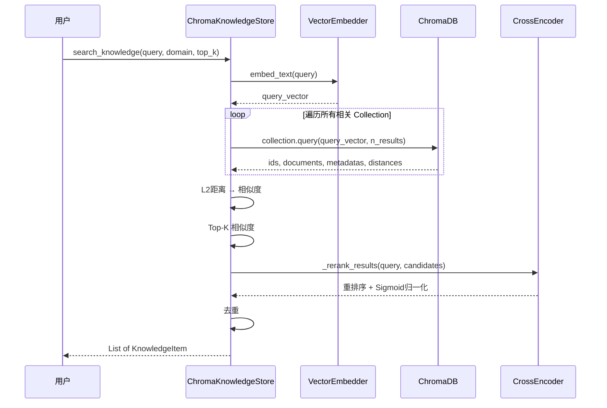
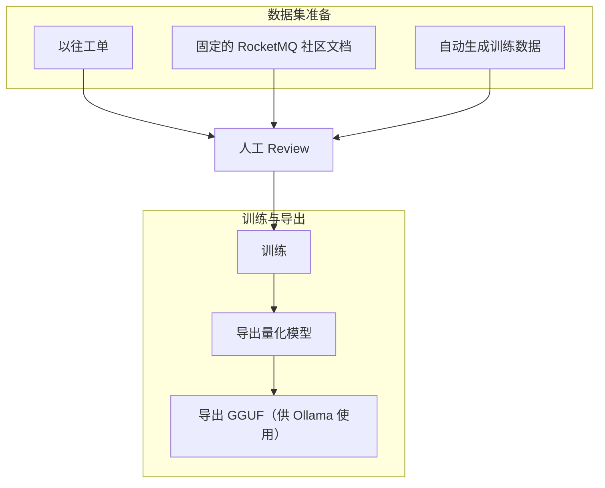

# Aether：基于小模型的智能运维 Agent 实践

> 在边缘环境与私有化场景下，如何用 ≤9B 参数的小模型构建一个真正可用的 Agent？本文介绍 Aether 项目的核心设计与工程实践——从模型选型、知识库检索、意图路由、Skill 编排到 LoRA 微调的全链路方案。

---

## 一、背景：为什么构建小模型 Agent？

### 1.1 业务痛点

在私有化运维场景中，我们面临四大核心痛点：

| 痛点 | 描述 |
|------|------|
| 🚨 **直播式排障** | 私有化场景下，故障排查依赖专家"直播式"远程指导，响应慢、效率低、知识难以沉淀复用 |
| 📚 **文档迷宫** | 文档越多，越难以派上用场。驻场人员、二线面临数款、数个版本的文档，真正遇上问题时无从查起 |
| 🔍 **信息黑盒** | 获取基本信息难——组件多，日志在哪儿、什么关键字、如何排查、Pod 如何组成，对于其他人都是黑盒 |
| 💻 **算力限制** | 不是所有客户都有显卡，但我们需要服务所有客户。在有限算力下实现智能排障，是产品普及的关键 |

### 1.2 技术选型动机

基于上述痛点，Aether 选择构建 **小模型 Agent** 方案：

- ✅ **超低成本**：基于 ≤9B 级小模型 + RAG 知识增强，在 CPU / 低显存环境下即可运行，无需 GPU 集群
- ✅ **知识可控**：通过 ChromaDB 向量知识库管理领域知识，支持增量更新，模型推理结果可追溯、可解释
- ✅ **Skill 编排**：将排障经验固化为结构化 Skill，Agent 自动编排执行，实现"直播式排障"的自动化闭环
- ✅ **数据私有化**：全链路本地部署，敏感数据不出域，满足企业级安全合规要求

---

## 二、快速开始：环境搭建与基础命令

> Aether 基于 [Nanobot](https://github.com/HKUDS/nanobot) 二次开发，以下命令均来自 Nanobot CLI 工具链。

### 2.1 安装

提供三种安装方式，推荐从源码安装以获取最新特性：

```bash
# 方式一：从源码安装（推荐，获取最新特性）
git clone https://github.com/HKUDS/nanobot.git
cd nanobot
pip install -e .

# 方式二：使用 uv 安装（快速、稳定）
uv tool install nanobot-ai

# 方式三：从 PyPI 安装（稳定版）
pip install nanobot-ai
```

> **命令解释**：
> - `pip install -e .`：以可编辑模式（editable mode）安装，修改源码后无需重新安装即可生效，适合开发调试
> - `uv tool install`：使用 Rust 编写的高性能包管理器 uv 安装，速度远快于 pip

### 2.2 初始化

首次使用需要初始化配置和工作空间：

```bash
nanobot onboard
```

> **命令解释**：`nanobot onboard` 会在 `~/.nanobot/` 目录下创建默认配置文件 `config.json` 和工作空间目录，是所有后续操作的前提。

### 2.3 配置

编辑 `~/.nanobot/config.json`，配置 LLM Provider 和 Agent 默认参数：

```json
{
  "providers": {
    "ollama": {
      "apiKey": "dummy",
      "apiBase": "http://localhost:11434"
    }
  },
  "agents": {
    "defaults": {
      "model": "qwen2.5:1.5b"
    }
  }
}
```

> **配置解释**：
> - `providers.ollama.apiKey`：Ollama 本地服务不需要真实 API Key，填任意非空字符串即可
> - `providers.ollama.apiBase`：Ollama 默认监听地址，确保 Ollama 服务已启动
> - `agents.defaults.model`：指定默认使用的模型，这里使用 Aether 选定的 `qwen2.5:1.5b`

### 2.4 常用 CLI 命令速查

| 命令 | 说明 |
|------|------|
| `nanobot onboard` | 初始化配置与工作空间 |
| `nanobot agent -m "..."` | 单次对话模式，发送一条消息并获取回复 |
| `nanobot agent` | 进入交互式对话模式（输入 `exit` / `quit` / `Ctrl+D` 退出） |
| `nanobot agent --no-markdown` | 以纯文本格式显示回复（不渲染 Markdown） |
| `nanobot agent --logs` | 对话时同时显示运行时日志，便于调试 |
| `nanobot gateway` | 启动网关服务，连接已启用的聊天渠道（Telegram/Discord/WebUI 等） |
| `nanobot status` | 查看当前配置状态、Provider 连接情况 |
| `nanobot webui` | 启动内置 Web 界面（默认端口 8000） |
| `nanobot webui --port 8080` | 指定自定义端口启动 Web 界面 |

### 2.5 验证安装

```bash
# 查看系统状态，确认 Provider 和模型配置正确
nanobot status

# 发送一条测试消息
nanobot agent -m "你好，请介绍一下你自己"
```

> **命令解释**：
> - `nanobot status`：输出当前所有 Provider 的连接状态、已配置的模型、启用的 Channel 等信息，是排查配置问题的第一步
> - `nanobot agent -m "..."`：单次对话模式，适合快速测试模型是否正常响应

---

## 三、小模型能力栈

### 3.1 主模型选择：`qwen2.5:1.5b`

| 模型 | 优点 |
|------|------|
| `qwen2.5:1.5b` | 中文支持好，国产。参数规模小、部署门槛低，适合边缘与私有化环境；推理速度快，能显著降低单轮响应耗时 |

**部署命令（Ollama 方式）：**

```bash
# 安装 Ollama（如未安装）
curl -fsSL https://ollama.ai/install.sh | sh

# 拉取 qwen2.5:1.5b 模型（Aether 默认主模型）
ollama pull qwen2.5:1.5b

# Ollama 服务会自动运行在 http://localhost:11434
```

> **命令解释**：
> - `curl -fsSL ... | sh`：从官方下载并执行 Ollama 安装脚本，`-fsSL` 表示静默下载、跟随重定向、失败时不输出 HTML
> - `ollama pull`：从 Ollama 模型仓库拉取指定模型到本地，类似 `docker pull`

**部署命令（vLLM 方式，适合有 GPU 的边缘服务器）：**

```bash
# 安装 vLLM
pip install vllm

# 启动 vLLM 推理服务（支持量化以节省显存）
vllm serve Qwen/Qwen2.5-1.5B-Instruct \
  --port 8000 \
  --max-model-len 4096 \
  --tensor-parallel-size 1
```

> **命令解释**：
> - `vllm serve`：启动一个兼容 OpenAI API 格式的推理服务
> - `--port 8000`：指定服务监听端口
> - `--max-model-len 4096`：限制最大上下文长度，降低显存占用
> - `--tensor-parallel-size 1`：张量并行数，单卡设为 1

**不同设备的模型选择参考：**

| 设备规格 | 推荐模型 | 适用场景 |
|----------|----------|----------|
| < 4GB RAM | `phi3:mini`（3.8B） | IoT 设备、极低资源环境 |
| 4-8GB RAM | `qwen2.5:1.5b` / `qwen2.5:7b` | 边缘 AI 盒子、桌面设备 |
| 8-16GB RAM | `qwen2.5:14b`（量化） | 工作站、小型服务器 |
| > 16GB RAM + GPU | `qwen2.5:32b`（量化） | 高性能边缘服务器 |

### 3.2 Rerank 模型：`bge-reranker-v2-m3`

| 模型 | 优点 |
|------|------|
| `bge-reranker-v2-m3` | 中文语义相关性判断效果稳定，能够提升召回结果排序质量，减少无关上下文，降低主模型处理负担 |

### 3.3 Embedding 模型：`BAAI/bge-large-zh-v1.5`

| 模型 | 优点 |
|------|------|
| `BAAI/bge-large-zh-v1.5` | 中文向量表示能力强、检索一致性高；在知识库问答中可提升召回准确率与稳定性 |

> Embedding 和 Rerank 模型均为本地加载，无需外部 API 调用。首次运行时会自动下载模型文件到 `~/.nanobot/models/` 目录。

### 3.4 Agent 开发选型

| 方案 | 说明 |
|------|------|
| 自研 | AI 自研，完全可控——**失败** |
| 二开 | 基于 [Nanobot（港大开源）](https://github.com/HKUDS/nanobot) 二次开发；**够小、够简单** |

---

## 四、知识库：ChromaDB + RAG + Rerank

### 4.1 设计目标

在 RAG 检索场景中，向量相似度搜索（Embedding + L2 距离）虽然能快速召回候选文档，但 **召回精度有限**。Rerank 系统通过引入 **CrossEncoder 交叉编码器** 对初步检索结果进行二次精排，显著提升最终返回结果的相关性。

### 4.2 检索流程



**流程说明：**

1. 接收用户 Query，构建标准化检索输入
2. 对 Query 执行 Embedding 向量化
3. 在 ChromaDB 中执行向量检索（L2 距离转换为相似度）
4. 返回 Top-K 候选文档
5. 使用 **CrossEncoder 对候选进行重排序** 打分
6. 对重排序分数做 **Sigmoid 归一化**
7. 按阈值过滤并按分数排序后返回结果

### 4.3 Rerank 核心价值

> **传统 Agent 流程**：向量检索 → Top-K → LLM → 输出结果

- **核心作用**：大幅度降低上下文长度，降低 SLM 耗时，解决"先看哪条证据"的问题
- **为什么需要**：提升答案质量并降低 SLM 幻觉风险
- **反直觉的工程权衡**：重排会增加少量时延，但在 SLM 场景下效果恰恰相反——总耗时反而降低

### 4.4 Rerank 流程伪代码

```python
def _rerank_results(query, results):
    # 1. 构建 Query-Document 对
    pairs = [(query, result['document']) for result in results]

    # 2. CrossEncoder 打分（原始分数通常在 -10 ~ 10 之间）
    scores = cross_encoder.predict(pairs)

    # 3. Sigmoid 归一化到百分制 (0-100)
    scaled_scores = [1 / (1 + exp(-score)) * 100 for score in scores]

    # 4. 阈值过滤（默认 60 分）
    filtered = [r for r, s in zip(results, scaled_scores) if s >= threshold]

    # 5. 按重排序分数降序排列
    return sorted(filtered, key=lambda x: x['rerank_score'], reverse=True)
```

### 4.5 Rerank 模型选型

在 SLM 条件下，几乎没得选！需要同时满足：**开源**、**离线**、**中文**，最终选择 `bge-reranker-v2-m3`。

### 4.6 RAG 配置体系

| 配置项 | 环境变量 | 默认值 | 说明 |
|--------|----------|--------|------|
| `embedding_model` | `NANOBOT_EMBEDDING_MODEL` | `""` | Embedding 模型名称/路径 |
| `chunk_size` | `NANOBOT_CHUNK_SIZE` | `500` | 分块大小（字符数） |
| `chunk_overlap` | `NANOBOT_CHUNK_OVERLAP` | `100` | 分块重叠大小 |
| `top_k` | `NANOBOT_TOP_K` | `5` | 检索返回结果数 |
| `similarity_threshold` | `NANOBOT_SIMILARITY_THRESHOLD` | `0.0` | 最低相似度阈值 |
| `rerank_model_path` | `NANOBOT_RERANK_MODEL_PATH` | `""` | Rerank 模型路径 |
| `rerank_threshold` | `NANOBOT_RERANK_THRESHOLD` | `0.8` | Rerank 过滤阈值 |

### 4.7 知识 Chunk 拆分调优

| 调优项 | 推荐范围 | 调优经验 | 风险提示 |
|--------|----------|----------|----------|
| chunk 大小 | 300~800 token | 先用 512 token 作为基线，再按召回质量微调 | 过小易语义缺失，过大易主题混杂 |
| 重叠大小 | 10%~20% | 从 64 token 起步，关注跨段问答命中率变化 | 过低会断上下文，过高会引入冗余与重复召回 |
| 人工 chunk border（新增支持） | 标题/步骤/代码块边界 | 先规则切分再模型切分，确保结构化知识完整落入单 chunk | 规则过多会导致 chunk 分布不均，影响批处理效率 |

### 4.8 RAG 完整配置示例

在 `~/.nanobot/config.json` 的 `agents.defaults` 中配置 RAG 参数：

```json
{
  "agents": {
    "defaults": {
      "model": "qwen2.5:1.5b",

      "embedding_model": "~/.nanobot/models/models--BAAI--bge-large-zh-v1.5",
      "chunk_size": 500,
      "chunk_overlap": 100,
      "top_k": 5,
      "similarity_threshold": 0.0,
      "batch_size": 32,
      "timeout": 5,

      "rerank_model_path": "~/.nanobot/models/bge-reranker-v2-m3",
      "rerank_threshold": 0.8
    }
  }
}
```

> **配置解释**：
> - `embedding_model`：本地 Embedding 模型路径，首次运行会自动下载到该目录，后续完全离线使用
> - `chunk_size` / `chunk_overlap`：控制文档分块策略，500 字符分块 + 100 字符重叠是推荐基线
> - `top_k`：向量检索返回的候选文档数量，Rerank 会在此基础上进一步精排
> - `batch_size`：批量向量化时的批大小，边缘设备建议降低到 16 以节省内存
> - `rerank_model_path`：Rerank 模型路径，留空则跳过重排序步骤
> - `rerank_threshold`：Rerank 分数阈值（0~1），低于此分数的结果将被过滤

**边缘设备优化配置（低内存场景）：**

```json
{
  "agents": {
    "defaults": {
      "model": "qwen2.5:1.5b",
      "embedding_model": "~/.nanobot/models/models--BAAI--bge-large-zh-v1.5",
      "chunk_size": 300,
      "chunk_overlap": 50,
      "top_k": 3,
      "batch_size": 16,
      "similarity_threshold": 0.7,
      "rerank_threshold": 0.85
    }
  }
}
```

> **优化说明**：更小的 chunk、更少的 top_k、更高的阈值，以牺牲少量召回率换取更快的响应速度和更低的内存占用。

### 4.9 知识库操作命令

```bash
# 运行 RocketMQ 知识库演示（内置知识自动初始化）
python examples/rocketmq_knowledge_demo.py

# 通过 Agent 搜索知识库
nanobot agent -m "搜索RocketMQ消息发送失败的排查指南"

# 通过 Agent 添加新知识条目
nanobot agent -m "添加一条关于RocketMQ消费者组配置的知识"

# 从文件导入知识库数据
nanobot knowledge import --from-file docs/knowledge.json

# 首次运行时初始化知识库（自动向量化所有知识）
nanobot agent -m "Initialize knowledge base"
```

> **命令解释**：
> - `python examples/rocketmq_knowledge_demo.py`：运行内置的 RocketMQ 知识库演示脚本，会自动加载预置的排障指南、配置文档等领域知识到 ChromaDB
> - `nanobot agent -m "搜索..."`：通过自然语言触发知识库的 `knowledge_search` 工具，Agent 会自动执行 RAG 检索流程
> - `nanobot knowledge import`：批量导入 JSON 格式的知识数据，支持增量更新，无需全量重建索引

---

## 五、分级路由：意图分类 + 智能路由

### 5.1 设计目标

**降低 LLM 处理耗时，增加推理准确性。**

| 对比维度 | 传统做法：Agent + 大模型 | 本项目做法：小模型 + Agent |
|----------|--------------------------|----------------------------|
| **处理路径** | 大多数请求都进入大模型意图理解与决策 | 先经分级路由独立模块，规则匹配优先，复杂场景再回退 LLM |
| **典型问题** | 每次都触发长 Prompt + 长推理链，排队与推理时延叠加 | 把高成本推理从主链路移到兜底链路，仅在必要时触发 |
| **耗时特征** | 整体偏 **秒级**，高峰时抖动明显 | 常见请求可达 **毫秒级~百毫秒级**，平均处理耗时显著下降 |

> **结论**：分级路由不只是"分类逻辑"，而是独立的性能治理模块——通过"规则快速命中 + LLM 兜底回退"的组合，将处理时延从默认秒级路径收敛为可控的低时延路径。

### 5.2 A/D 两级分类

#### A 类 — 知识问答

纯知识性问题，交由 LLM 直接回答。通过 **关键词模式匹配** 快速识别。

常见触发词：`是什么`、`什么是`、`介绍一下`、`解释一下`、`有什么区别`、`原理`、`what is`、`explain`

#### D 类 — 操作/排查

需要执行具体操作的请求，进入 Skill 执行流程。采用 **两阶段匹配** 策略：

- **阶段一**：规则匹配（RuleMatchEngine）— 毫秒级
- **阶段二**：LLM 分类 — 回退策略

### 5.3 阶段一：规则匹配

> 📁 `nanobot/rca/rule_engine.py`

- **配置化规则**：`{skill_name: [regex_pattern, ...]}` 格式
- **毫秒级响应**：预编译正则表达式
- **动态管理**：运行时 `add_rule` / `remove_rules`

```json
{
    "check_pod_status": ["查看.*pod", "pod.*状态"],
    "check_disk_usage": ["磁盘.*满", "disk.*full"]
}
```

### 5.4 阶段二：LLM 分类

当规则匹配未命中时，回退到 LLM 快速分类：

1. **构建 Prompt**：将所有已注册的 Skill 名称列表构建为 Prompt
2. **LLM 选择**：让 LLM 从列表中选择最匹配的 Skill，或返回 `"unsupported"`
3. **结果校验**：精确匹配 + 忽略大小写匹配校验

> ⚠️ **关键约束**：LLM 在此阶段 **仅用于分类**，不参与执行、不生成步骤、不推理根因。

### 5.5 路由效果验证

通过 Agent 交互模式可以直观验证分级路由的效果：

```bash
# A 类请求示例 — 触发知识问答路由（关键词匹配，毫秒级）
nanobot agent -m "RocketMQ 的消息存储原理是什么？"

# D 类请求示例 — 触发 Skill 执行路由
nanobot agent -m "帮我查看 broker 的 Pod 状态"

# 开启日志模式观察路由决策过程
nanobot agent --logs -m "检查磁盘是否满了"
```

> **命令解释**：
> - 第一条消息包含触发词"是什么"，会被规则引擎快速识别为 A 类（知识问答），直接走 RAG + LLM 回答路径
> - 第二条消息匹配规则 `"查看.*pod"`，被规则引擎命中为 D 类（操作/排查），进入 `check_pod_status` Skill 执行流程
> - `--logs` 参数会输出运行时日志，可以看到路由决策的完整过程：规则匹配 → LLM 分类 → Skill 选择

---

## 六、重新设计 Skill：从 Tool 到 SOP

### 6.1 设计理念

**Tool → Atomic Skill → SOP Skill**

| 对比维度 | 传统做法：大模型 plan + exec plan | 本项目做法：Embedding Skill + 分步骤执行 |
|----------|-----------------------------------|------------------------------------------|
| **处理路径** | 注入到模型提示词 | SOP Skill = 多个 Atomic Skill |
| **典型问题** | 控制可见性/允许列表；加载与过滤；安装越多越慢 | SLM 执行 Skill 变成可能 |
| **耗时特征** | 安装越多越慢 | 取决于单步骤耗时，每个步骤 = Atomic Skill，耗时可控 |

> **结论**：分步骤执行将 SLM 执行 Skill 变成可能。但需要注意：
> 1. 开源的 Skill 格式无法通用，需要转格式，升级、维护需要自动化工具支持
> 2. 执行整体耗时偏大，分步骤后整体执行耗时变大，待优化

### 6.2 Atomic Skill（原子技能）

单工具封装，是最小的执行单元：

```yaml
skill:
  name: get_rocketmq_pods
  version: "1.0"
  type: atomic
  description: |
    [内部原子技能] 直接调用 kubectl_get_pods 工具获取 Pod 列表。
  input_schema:
    namespace: string
    component_keyword: string
    exclude_keywords: string
  output_schema:
    pods: list
    total: int
  execution:
    steps:
      - id: fetch
        type: tool
        tool: kubectl_get_pods
        input:
          namespace: "{{namespace}}"
          component_keyword: "{{component_keyword}}"
          exclude_keywords: "{{exclude_keywords}}"
```

### 6.3 SOP Skill（标准操作流程）

多步骤编排，将多个 Atomic Skill 和 LLM 调用串联为完整的排障流程：

```yaml
skill:
  name: resolve_and_get_rocketmq_pods
  version: "1.0"
  type: sop
  description: |
    查询 RocketMQ 组件的 Pod 列表、进程状态、服务运行信息。
    自动将用户输入的组件简称映射为 Kubernetes 中的实际关键字。
  input_schema:
    param1: string         # 用户输入的原始文本
  output_schema:
    pods: list
    total: int
  execution:
    steps:
    - id: resolve_component
      type: llm
      input:
        param1: "{{user_input}}"
      prompt: |
        你是一个信息抽取器，只做字段提取，不做解释。
        【任务】从用户输入中提取3个字段，并输出JSON：
        - namespace
        - component_keyword
        - exclude_keywords

        【组件枚举（只能选一个）】
        broker -> ocloud-tdmq-rocketmq5-broker
        namesrv -> ocloud-tdmq-rocketmq5-namesrv
        proxy -> ocloud-tdmq-rocketmq5-proxy
        manager -> ocloud-tdmq-rocketmq-manager

        【规则】
        1. component_keyword 必须从上面枚举中选择一个
        2. namespace 如果没有，填 ""
        3. exclude 如果没有，填 ""
        4. 只输出 JSON，不要任何解释

        【输出格式】
        {"namespace":"","component_keyword":"","exclude_keywords":""}
      output_schema:
        component_keyword: string
        exclude_keywords: string
        namespace: string

    - id: get_rocketmq_pods
      type: skill
      skill: get_rocketmq_pods
      input:
        namespace: "{{resolve_component.namespace}}"
        component_keyword: "{{resolve_component.component_keyword}}"
        exclude_keywords: "{{resolve_component.exclude_keywords}}"
      output_schema:
        pods: list
        total: int
```

### 6.4 步骤执行引擎

每个步骤通过入参、出参相互关联。前一步骤的输出作为后一步骤的输入，形成链式调用。

| 步骤类型 | 执行方式 | 说明 |
|----------|----------|------|
| **skill** | 查找 Atomic Skill → 解析输入 → 安全校验 → 执行 → 校验输出 | 通过 Atomic Skill 间接调用工具 |
| **tool** | 解析输入 → 安全校验 → ToolRegistry 直接执行 | 直接调用 ToolRegistry 中的工具 |
| **llm** | 解析引用 → 渲染 Prompt → 单轮 SLM 调用 → 解析 JSON | 独立的 LLM 调用，最小上下文 |
| **root_cause_definition** | 收集前置步骤输出 → 遍历规则 → 条件匹配 → 输出根因 | 确定性规则引擎，不依赖 LLM |

### 6.5 报告生成

Skill 执行完成后，自动生成结构化排障报告，包含以下模块：

| 模块 | 数据来源 |
|------|----------|
| 📝 **故障摘要** | 从 LLM 总结步骤的 `summary` 字段提取 |
| 🔍 **根因判断** | 从 `root_cause_definition` 或 LLM 步骤提取 |
| 📊 **置信度** | 成功步骤数 / 总步骤数 |
| 🛤️ **执行轨迹** | 每个步骤的 ID、类型、状态和耗时 |
| 🔧 **修复建议** | 从 `solution` 和 `recommendation` 字段汇总 |

---

## 七、LoRA 微调：将小模型调教为 RocketMQ 专家

### 7.1 微调流程

通过定向 LoRA 微调，将通用小模型适配为 RocketMQ 领域专家。



### 7.2 详细步骤

#### 步骤一：数据集准备

1. **以往工单**：收集历史运维工单作为原始训练素材，覆盖实际故障场景
2. **固定文档**：整合官方文档、最佳实践指南等结构化知识
3. **自动生成训练数据**：基于模板生成多样化训练样本，扩充数据规模

训练数据需要整理为标准的 JSONL 格式（每行一个 JSON 对象）：

```jsonl
{"instruction": "RocketMQ broker 启动失败怎么排查？", "input": "", "output": "1. 检查日志 store/logs/broker.log...\n2. 确认端口未被占用...\n3. 检查磁盘空间..."}
{"instruction": "如何查看消费者组的消费进度？", "input": "", "output": "使用 mqadmin consumerProgress 命令..."}
```

#### 步骤二：人工 Review

对数据集进行质量审核、格式标准化和样本筛选，确保训练数据准确性和一致性。

#### 步骤三：训练

采用 LoRA / QLoRA 等参数高效微调技术，支持在本地设备（如 MacBook Pro M4）下定向训练。

**方式一：使用 LlamaFactory 训练（推荐）**

```bash
# 安装 LlamaFactory
git clone https://github.com/hiyouga/LLaMA-Factory.git
cd LLaMA-Factory
pip install -e ".[torch,metrics]"

# 启动 Web UI 进行可视化训练配置
llamafactory-cli webui

# 或使用命令行启动训练（指定配置文件）
llamafactory-cli train examples/train_lora/qwen2.5_lora_sft.yaml
```

> **命令解释**：
> - `llamafactory-cli webui`：启动 LlamaFactory 的 Web 训练界面，可以可视化配置训练参数（模型、数据集、LoRA rank、学习率等），适合快速实验
> - `llamafactory-cli train`：使用 YAML 配置文件启动训练，适合批量化、可复现的训练流程
> - LoRA 微调只更新少量参数（通常 < 1% 的模型参数），显存需求远低于全量微调

**方式二：本地代码训练**

```bash
# 使用 transformers + peft 进行 LoRA 微调
pip install transformers peft datasets accelerate bitsandbytes

# 运行训练脚本
python train_lora.py \
  --model_name_or_path Qwen/Qwen2.5-1.5B-Instruct \
  --dataset_path ./data/rocketmq_train.jsonl \
  --output_dir ./output/qwen2.5-1.5b-rocketmq-lora \
  --lora_rank 8 \
  --lora_alpha 16 \
  --num_train_epochs 3 \
  --per_device_train_batch_size 4 \
  --learning_rate 2e-4
```

> **命令解释**：
> - `--lora_rank 8`：LoRA 的秩（rank），控制可训练参数量，8 是小模型的推荐值
> - `--lora_alpha 16`：LoRA 的缩放因子，通常设为 rank 的 2 倍
> - `--per_device_train_batch_size 4`：每个设备的训练批大小，内存不足时可降低到 1-2
> - `--learning_rate 2e-4`：学习率，LoRA 微调推荐 1e-4 ~ 5e-4

#### 步骤四：导出量化模型

训练完成后导出量化模型，优化推理效率和资源占用。

```bash
# 合并 LoRA 权重到基础模型
python -c "
from peft import PeftModel
from transformers import AutoModelForCausalLM, AutoTokenizer

base_model = AutoModelForCausalLM.from_pretrained('Qwen/Qwen2.5-1.5B-Instruct')
lora_model = PeftModel.from_pretrained(base_model, './output/qwen2.5-1.5b-rocketmq-lora')
merged_model = lora_model.merge_and_unload()
merged_model.save_pretrained('./output/qwen2.5-1.5b-rocketmq-merged')
"

# 或使用 LlamaFactory 导出
llamafactory-cli export examples/merge_lora/qwen2.5_lora_sft.yaml
```

> **命令解释**：
> - `merge_and_unload()`：将 LoRA 适配器权重合并回基础模型，生成一个完整的独立模型，后续部署无需再加载 LoRA 适配器
> - `llamafactory-cli export`：LlamaFactory 提供的一键导出命令，自动完成合并和保存

#### 步骤五：导出 GGUF

转换为 GGUF 格式，适配 Ollama 部署，实现低成本、易部署的小模型推理服务。

```bash
# 克隆 llama.cpp（包含 GGUF 转换工具）
git clone https://github.com/ggerganov/llama.cpp.git
cd llama.cpp

# 安装 Python 依赖
pip install -r requirements.txt

# 将 HuggingFace 模型转换为 GGUF 格式
python convert_hf_to_gguf.py \
  ../output/qwen2.5-1.5b-rocketmq-merged \
  --outfile ../output/qwen2.5-1.5b-rocketmq.gguf \
  --outtype q4_k_m

# 创建 Ollama Modelfile
cat > ../output/Modelfile << 'EOF'
FROM ./qwen2.5-1.5b-rocketmq.gguf

PARAMETER temperature 0.5
PARAMETER top_p 0.9
PARAMETER num_ctx 4096

SYSTEM """你是 Aether，一个专业的 RocketMQ 运维助手。你擅长排查 RocketMQ 相关的故障、解答配置问题、提供最佳实践建议。"""
EOF

# 使用 Ollama 创建自定义模型
ollama create qwen2.5-rocketmq -f ../output/Modelfile

# 验证微调模型
ollama run qwen2.5-rocketmq "RocketMQ broker 启动失败怎么排查？"
```

> **命令解释**：
> - `convert_hf_to_gguf.py`：llama.cpp 提供的转换脚本，将 HuggingFace 格式模型转换为 GGUF 格式
> - `--outtype q4_k_m`：指定量化类型，`q4_k_m` 是 4-bit 量化的推荐选项，在精度和体积之间取得良好平衡
> - `ollama create`：基于 Modelfile 创建自定义 Ollama 模型，Modelfile 中可以指定系统提示词、温度等参数
> - `ollama run`：运行模型进行交互式对话，验证微调效果

---

## 八、部署与运行

### 8.1 Docker 容器化部署

使用 Docker 可以实现一键部署，无需手动配置环境依赖：

```bash
# 构建 Docker 镜像
docker build -t nanobot .

# 初始化配置（仅首次需要）
docker run -v ~/.nanobot:/root/.nanobot --rm nanobot onboard

# 编辑宿主机上的配置文件，添加 API Key 和模型配置
vim ~/.nanobot/config.json

# 启动网关服务（连接 Telegram/Discord/WebUI 等渠道）
docker run -d \
  --name nanobot \
  -v ~/.nanobot:/root/.nanobot \
  -p 18790:18790 \
  nanobot gateway

# 单次对话模式
docker run -v ~/.nanobot:/root/.nanobot --rm nanobot agent -m "Hello!"

# 查看系统状态
docker run -v ~/.nanobot:/root/.nanobot --rm nanobot status
```

> **命令解释**：
> - `-v ~/.nanobot:/root/.nanobot`：将宿主机的配置目录挂载到容器内，确保配置和工作空间在容器重启后持久化
> - `-p 18790:18790`：映射网关服务端口，用于 WebUI 和 API 访问
> - `--rm`：容器执行完毕后自动删除，适合一次性命令
> - `-d`：后台运行容器，适合长期运行的网关服务

**边缘设备资源限制部署：**

```bash
# 限制容器资源使用（适合边缘设备）
docker run -d \
  --name nanobot \
  --memory=4g \
  --cpus=2 \
  -v ~/.nanobot:/root/.nanobot \
  -p 8000:8000 \
  nanobot gateway

# 监控容器资源使用情况
docker stats nanobot
```

> **命令解释**：
> - `--memory=4g`：限制容器最大内存为 4GB，防止 OOM 影响宿主机其他服务
> - `--cpus=2`：限制容器最多使用 2 个 CPU 核心
> - `docker stats`：实时监控容器的 CPU、内存、网络 I/O 等资源使用情况

### 8.2 WebUI 启动

Nanobot 内置了现代化的 Web 聊天界面，支持实时流式响应：

```bash
# 启动 WebUI（默认端口 8000）
nanobot webui

# 指定自定义端口
nanobot webui --port 8080

# 开发模式（支持热重载）
nanobot webui --debug --reload
```

> **命令解释**：
> - `nanobot webui`：启动内置 Web 界面，浏览器访问 `http://localhost:8000` 即可使用
> - `--debug`：开启调试模式，输出详细日志信息
> - `--reload`：文件变更时自动重启服务，适合开发调试

**WebUI 配置（可选）：**

```json
{
  "webui": {
    "enabled": true,
    "port": 8000,
    "host": "0.0.0.0",
    "debug": false,
    "cors_origins": ["http://localhost:3000"]
  }
}
```

**WebUI REST API 端点：**

| 端点 | 方法 | 说明 |
|------|------|------|
| `/api/health` | GET | 健康检查 |
| `/api/chat` | POST | 发送消息给 Agent |
| `/api/sessions` | GET | 列出所有聊天会话 |
| `/api/sessions/{id}` | GET | 获取指定会话的历史记录 |

```bash
# 通过 API 发送消息
curl -X POST http://localhost:8000/api/chat \
  -H "Content-Type: application/json" \
  -d '{"message": "查看 broker 的 Pod 状态", "session_id": "test-001"}'
```

### 8.3 Gateway 网关服务

Gateway 是 Aether 的核心运行模式，负责连接各类聊天渠道并持续监听消息：

```bash
# 启动网关（连接所有已启用的渠道）
nanobot gateway

# 查看渠道连接状态
nanobot channels status
```

> **命令解释**：
> - `nanobot gateway`：启动网关服务，会自动连接 `config.json` 中所有 `enabled: true` 的渠道（Telegram、Discord、WebUI、飞书等），持续监听并响应消息
> - `nanobot channels status`：查看各渠道的连接状态，排查渠道连接问题

### 8.4 定时任务

支持通过 Cron 表达式配置定时任务，实现自动化巡检：

```bash
# 添加每日定时巡检任务（每天早上 9 点执行）
nanobot cron add --name "daily-check" \
  --message "检查所有 RocketMQ 组件的 Pod 状态" \
  --cron "0 9 * * *"

# 添加按间隔执行的任务（每 3600 秒 = 1 小时）
nanobot cron add --name "hourly-health" \
  --message "执行健康检查" \
  --every 3600

# 查看所有定时任务
nanobot cron list

# 删除指定任务
nanobot cron remove <job_id>
```

> **命令解释**：
> - `nanobot cron add --cron "0 9 * * *"`：使用标准 Cron 表达式定义执行时间，`0 9 * * *` 表示每天 09:00 执行
> - `--every 3600`：按固定间隔（秒）重复执行，适合周期性巡检
> - `--message`：定时触发时发送给 Agent 的消息内容，Agent 会按正常流程处理（路由 → Skill 执行 → 生成报告）

### 8.5 安全配置

生产环境部署时，建议启用工作空间沙箱限制：

```json
{
  "tools": {
    "restrictToWorkspace": true
  }
}
```

> **配置解释**：
> - `restrictToWorkspace: true`：将 Agent 的所有工具操作（Shell 执行、文件读写等）限制在工作空间目录内，防止路径穿越和越权访问，是生产环境的必要安全措施

---

## 九、总结

### 9.1 核心优势

| 优势 | 说明 |
|------|------|
| 💰 **1/5 成本运行/训练** | 基于 1~9B 级小模型设计，在 CPU / 低显存环境下即可运行，大幅降低部署门槛。知识增强策略替代大参数量，实现低成本运行、训练、迭代 |
| 🎯 **更专业的领域能力** | 通过领域知识增强和 RCA 技能编排，具备专业运维排障能力。结构化 Skill 体系确保推理结果可追溯、可解释、可复用 |

### 9.2 经验总结

| 经验 | 要点 |
|------|------|
| **核心：领域数据质量** | 真实有效的数据，直接决定 Agent 的准确性 |
| **小模型提示词优化** | 完形填空式优化 |
| **去掉业务无关的系统提示词** | 移除 `AGENTS.md`、`SOUL.md`、`USER.md` 等无关提示词 |

### 9.3 后续方向

| 方向 | 说明 |
|------|------|
| 🔗 **与其他主 Agent 打通** | 与企业现有 AI Agent、监控告警平台、运维中台等系统对接，形成智能运维闭环（如 TCS-Agent、TCE Cloud Mate） |
| 🧠 **源代码 RAG** | 结合有版本的源代码，将源代码排查融入 SOP Skill |
| 💬 **多轮对话** | 复杂排查场景需要多轮交互澄清问题。目前常规 Agent 利用大模型长上下文的能力保持对话连贯性的模式在小模型上完全跑不通——耗时超乎想象，幻觉是常态 |
| 🧠 **记忆管理** | 长期记忆与短期记忆的平衡，历史会话状态的存储与检索。当前策略：抛弃记忆，或将记忆上移到主 Agent |

---

*Aether — 用小模型做大事，让智能运维触手可及。*
