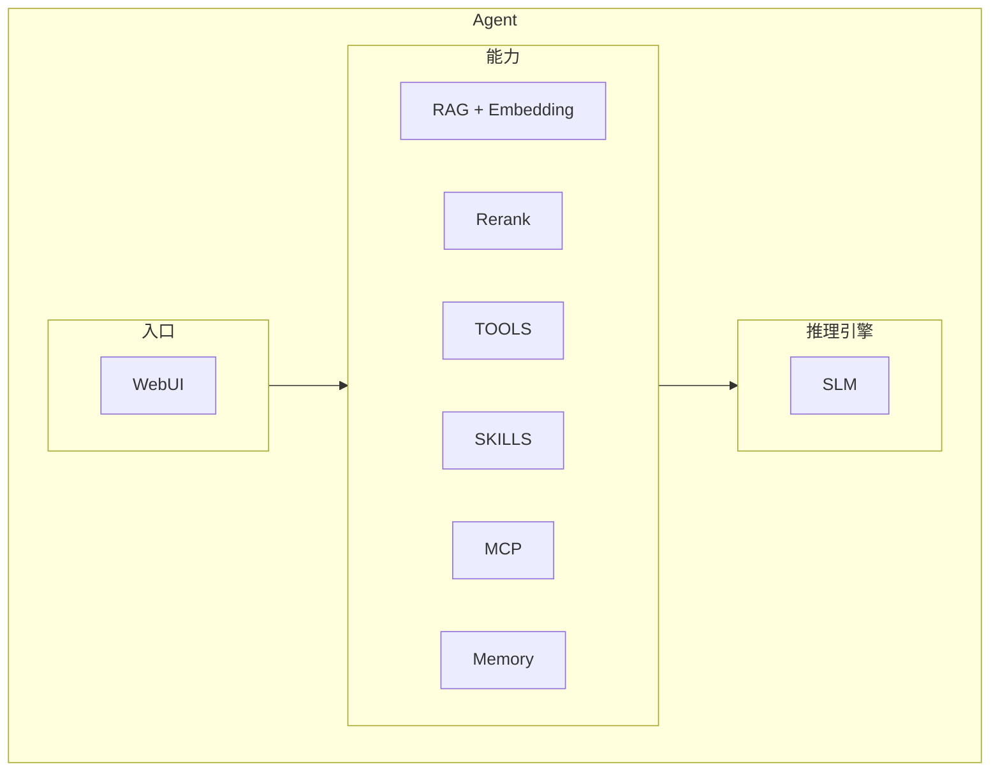
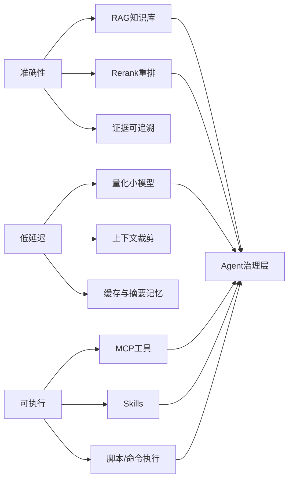
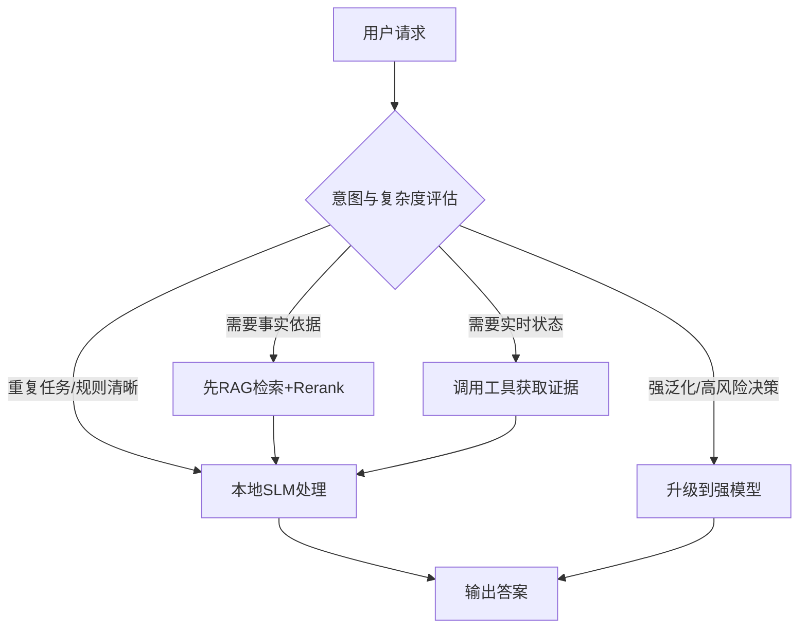
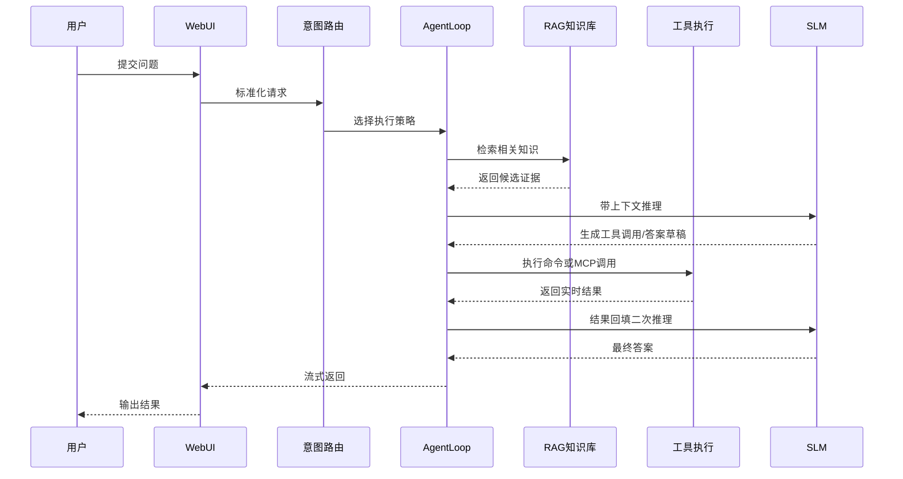

### 一、先抛出问题：私有化、无公网、无 GPU，如何用 AI Agent 提效 AIOps？

在TCE/TCS 场景下，最常见的约束是：

- **私有化部署**：数据不可出域，外部 API 不可直连。
- **无公网/弱公网**：模型下载、在线检索、云推理都受限。
- **无GPU资源**：不是所有客户都有预算买GPU，但是所有客户都需要我们支持。只能用 CPU 或极少量共享算力。

同时业务目标又非常明确：

- **准确性**：产品问答、产品排障建议不能“看起来合理”，必须可验证。
- **低延迟**：值班、告警、处置链路要求秒级反馈。
- **可验证执行**：能联动私有化产品文档、POC文档、产品SOP等知识库、`MCP`、`Skills` 和脚本，而不只是聊天。

所以问题本质不是“能不能上大模型”，而是：

> **在受限资源下，如何构建准确、可靠、低延迟、可治理的 Agent 系统来提效Ops**

### 二、模型选型

#### 1）模型选型原则

- **小参数模型**：以 `1B~4B` 为主力区间，兼顾效果与时延。
- **量化模型**：优先选择有成熟 `INT4/INT8` 或 GGUF 生态的模型。
- **蒸馏版本**：在推理、数学、代码子任务中优先尝试蒸馏模型。
- **中文支持**：AIOps 场景常含中文日志、命令、术语，中文能力权重更高。
- **推理**：不是核心，能用系统设计补足；模型能力不强时，靠 RAG、Rerank、工具调用来补齐。
- **生态成熟**：优先考虑社区活跃、工具链完善的模型，降低集成和后续迭代成本。
- **Coding尽量**：不是重点

#### 2）小模型对比

> 说明：下表用于工程选型“首轮过滤”，最终以你们在目标数据集上的离线评测为准。

| 模型系列          | 代表模型                              |    参数规模 | 量化生态               | 蒸馏版本         | 中文/AIOps适配 | 优势                | 风险点          |
|---------------|-----------------------------------|--------:|--------------------|--------------|------------|-------------------|--------------|
| Qwen2.5       | `Qwen2.5-0.5B/1.5B/3B-Instruct`   | 0.5B~3B | 强（Ollama/GGUF 较完善） | 丰富（含多种蒸馏社区版） | 高          | 中文理解好、工具调用友好、生态成熟 | 超复杂推理需路由升级   |
| Microsoft Phi | `Phi-3.5-mini-instruct`           |   ~3.8B | 中-强                | 有蒸馏实践        | 中          | 英文推理与代码任务稳定、体积小   | 中文垂类需额外对齐    |
| Llama 小模型     | `Llama-3.2-1B/3B-Instruct`        |   1B~3B | 强                  | 社区蒸馏多        | 中          | 通用能力均衡、部署方式多      | 中文和行业术语需加强   |
| 蒸馏专项模型        | `DeepSeek-R1-Distill-Qwen-1.5B` 等 | 1.5B~4B | 依模型而定              | 核心特征         | 中-高        | 在特定推理任务上性价比高      | 泛化与稳定性依赖任务边界 |

#### 3）为什么“小模型推理弱”仍可落地

核心做法不是强行用小模型硬扛，而是通过系统设计补足：

- **`RAG` 补知识**：把事实交给知识库，不让模型“背答案”。
- **`Rerank` 补证据质量**：先检索再重排，优先高相关证据。
- **`Tools/MCP/Skills` 补执行能力**：实时状态来自命令和接口，不来自猜测。
- **分级路由补上限**：复杂请求升级强模型，常规请求留在小模型链路。

#### 4）微软 Azure 观点提炼并融入（SLM 认知补充）

基于微软 Azure
词典文章（[什么是小语言模型（SLM）](https://azure.microsoft.com/zh-cn/resources/cloud-computing-dictionary/what-are-small-language-models)
）的核心观点，可补充以下工程结论：

- **SLM 的定位**：参数更小、结构更轻，面向特定任务优化；不是“弱化版 LLM”，而是“任务定制型模型”。
- **与 LLM 的本质差异**：
    - SLM 偏“垂直深挖”，LLM 偏“通用覆盖”；
    - SLM 算力与能耗成本更低，更适合边缘与内网环境。
- **最关键收益**：
    - 在资源受限环境可运行（CPU/低配节点友好）；
    - 训练与迭代周期更短，适合快速试错；
    - 在经过领域微调后，特定任务准确性可优于通用模型。
- **关键局限**：
    - 复杂推理与长链路任务能力上限低于大模型；
    - 对上下文噪声更敏感，提示词治理要求更高。

结合本文场景（私有化、无公网、无 GPU），将该观点落地为三条架构准则：

1. **默认 SLM，复杂升级**：高频请求优先本地 SLM，复杂请求再路由强模型。
2. **模型不单打，系统来补足**：用 `RAG + Rerank + Tools/MCP/Skills` 补齐知识与执行能力。
3. **小步快跑持续优化**：以量化、蒸馏、定向微调持续提升“准确性/时延”比。

这一定义与 Aether 当前路线一致：把“模型大小竞争”转为“任务匹配与系统协同竞争”。
如何设计一个面向**资源受限场景**的轻量级智能体系统，核心目标不是“堆功能”，而是在有限算力下实现可用、可扩展、可维护的
Agent 能力。项目通过“小模型 + 本地 RAG + 工具调用 + Skills”的组合，兼顾了离线可用性、隐私保护与工程实用性。

### 三、架构图与说明

**Rerank**: `Rerank` 的核心作用是在向量召回后，把“最相关、最可用、最可引用”的证据排到前面，再交给模型生成答案。它解决的不是“有没有检索到”，而是“先看哪条证据”。

- 降低推理成本。最直接效果是减少上下文传递给SLM，极大的降低推理耗时和整体使用体验
- 为什么需要：向量检索返回的是“语义近似集合”，其中常混有边缘相关内容；直接生成会降低答案稳定性。
  增加rerank，提高答案质量，减少SLM幻觉风险
- 典型收益：提高命中质量、减少幻觉、提升答案可解释性（证据更聚焦）。
- 工程权衡：重排会增加少量时延，但在运维、知识问答等高准确场景通常收益明显。
- 说明：默认所有核心能力在内网闭环运行，云侧是“可选增强”而非必需依赖。
- 关键点：即使无 GPU，也能通过 SLM + RAG + Rerank + Tools 完成主要业务链路。

#### 能力目标约束

#### 分级路由决策图

- **说明**：将高成本模型调用限制在少数复杂请求，常规请求走低成本链路。
- **关键点**：路由是成本治理抓手，也是私有化项目稳定性的保障。

### 四、时序图

- **说明**：先检索、再重排、再推理、再执行、再回填，是降低幻觉和提升可靠性的关键。
- **关键点**：对运维场景优先“拿证据”，而不是直接生成结论。

### 五、关键调用链路

以一次典型 Web 请求为例：

1. 用户消息通过 WebSocket 进入系统。
2. 先做意图分类（A 问答 / B 运维操作 / C 故障排查）。
3. 按意图选择路径：
    - A：优先知识库检索，并通过 rerank 重排证据后生成回答。
    - B/C：检索 tools/skills，同时对候选知识进行重排，将高相关结果注入上下文后进入 AgentLoop 执行。
4. AgentLoop 调用模型并触发工具执行（如 shell、MCP、知识工具）。
5. 工具结果回填后继续迭代，直到产出最终答案。
6. 响应以流式方式返回前端，并附带耗时与执行状态。

到此呢，基于私有化的RocketMQ排障Agent系统初步搭建完成，
它的质量体现更多的是我们出入的知识、SKILL的准确性。而不是模型的参数规模。通过不断迭代知识库、工具链和模型微调，我们可以持续提升系统的准确性和实用性。

### 六、待解决的大问题

#### 长记忆导致推理耗时不可预估

**主流大模型 Agent 常见做法**：

- 会话历史全量保留 + 定期摘要。
- 长期记忆分层：语义记忆（向量库）、过程记忆（工具执行轨迹）、用户偏好记忆。
- 按 query 检索相关记忆回填上下文，再进行生成。

**小模型场景的问题**：

- 记忆放得越多，提示词越长，时延越高；
    - 小模型对长上下文噪声更敏感，容易“记不住重点”。

**小模型可落地方案（准确性 vs 延迟）**：

- **三层记忆**：
    - 热记忆（最近 3~8 轮，直接拼接）
    - 温记忆（会话摘要 + 关键槽位）
    - 冷记忆（向量库检索）
    - **上下文预算控制**：对提示词设置硬预算，超预算优先保留“任务目标、最新证据、未完成动作”。
    - **记忆门控**：只有当 query 与记忆相似度超过阈值时才回填，避免“无关记忆污染”。
    - **摘要滚动更新**：每 N 轮自动摘要一次，把冗长对话压缩成结构化状态。

- 多轮问答
  由于小模型推理能力有限， 多轮问答中模型很难自己判断什么时候需要调用工具，什么时候需要检索，什么时候需要升级到强模型。需要在系统设计上做更多的引导和约束。

- 定向训练
  因为定位解决TCE/TCS上的问题，整体产品范围有限，可以通过定向训练让小模型在特定任务上表现更好。需要设计合理的训练方案，构建高质量的训练数据，并且持续迭代优化。

#### 多轮问答越问越慢

**主流大模型 Agent 常见做法**：

- 对话状态机 + 工具调用循环；
- 通过系统提示约束角色、目标与输出结构；
- 结合反思/重试机制降低工具调用失败率。

**OpenClaw（公开资料可见的方向性实践）**：

- 更强调多 Agent 分工与消息流协作；
- 倾向把任务状态外置（例如任务板/流程状态），而不是全部压在单轮上下文；
- 通过角色拆分降低单模型负担。

**小模型多轮问答建议**：

- **状态先行**：把“问题定义、已确认事实、待执行动作、完成结果”结构化存储。
- **问题改写**：每轮先把用户输入改写为“独立可执行 query”，再检索和推理。
- **证据优先回复**：先给结论证据，再给解释，最后给下一步动作。
- **失败可恢复**：工具失败时返回可重试步骤，而不是直接终止会话。

#### 小模型定向训练：技术方案与预期

在私有化、无公网、无 GPU 场景下，定向训练的目标不是追求“通用最强”，而是让小模型在 AIOps 任务上做到**更稳、更快、更可控**。

**技术方案（建议三阶段）**：

- **阶段 A：数据构建与清洗**
    - 构建领域样本：告警工单、排障手册、命令执行记录、事故复盘报告。
    - 统一训练模板：`问题 -> 证据 -> 诊断 -> 动作 -> 回滚`，强化可执行输出。
    - 增加高质量负样本：相似但错误的根因/命令，提升判别能力。

- **阶段 B：轻量微调与蒸馏对齐**
    - 优先 `LoRA/QLoRA` 等参数高效微调，降低训练资源门槛。
    - 训练目标拆分为：指令遵循、工具调用决策、证据引用习惯。
    - 采用教师-学生蒸馏：用强模型生成高质量轨迹，蒸馏到 `1B~4B` 学生模型。

- **阶段 C：联调上线与持续迭代**
    - 与 `RAG + Rerank + Tools` 联调，不把准确性完全压在模型参数上。
    - 灰度上线：先低风险任务，基于失败案例持续回灌训练数据。
    - 版本治理：模型版本、数据版本、评测结果三者可追溯。

**落地原则**：定向训练负责“领域习惯与输出结构”，`RAG/Rerank` 负责“事实准确”，`Tools/MCP/Skills` 负责“执行闭环”，三者协同才能兼顾准确性与低延迟。

### 边缘AI解决方案思考

边缘AI方案讨论时，模型能力不再是依赖的核心，整体方案不是单点优化，而是系统级协同：

- **模型侧：小模型优先，本地优先**
    - 支持 Ollama / vLLM，便于在边缘节点部署 SLM。
    - 通过统一 Provider 抽象，实现本地模型与云模型平滑切换。

- **知识侧：本地 RAG + Rerank，减少大模型负担**
    - 先检索、再重排、再生成，把“事实性内容”交给向量库与重排层。
    - 降低 token 压力与推理成本，提升低算力场景可用性。

- **执行侧：工具化而非纯生成**
    - 对运维场景，优先执行真实命令获取实时状态，再做解释。
    - 避免“只会说不会做”的问答式幻觉。

- **工程侧：轻量与可观测并重**
    - 核心代码量小，结构清晰，便于在边缘环境快速定位问题。
    - 全链路日志、迭代耗时、工具耗时可追踪，方便性能调优。

### 行业对于小模型

- **[Nvidia] Small Language Models are the Future of Agentic AI**

  大型语言模型（LLMs）因在广泛任务中展现出接近人类的性能及其通用对话能力而备受赞誉。然而，自主智能体AI系统的兴起正推动大量应用的出现，
  其中语言模型只需重复执行少量专业化任务且变化有限。
  在此，我们提出一种观点：对于自主智能体系统中的多数调用场景，小语言模型（SLMs）已具备足够能力，本质上更为适用，且必然更具经济性，
  因此将成为自主AI的未来。这一论点基于当前SLMs所展现的能力水平、自主系统的常见架构以及语言模型部署的经济性。我们进一步认为，
  在通用对话能力至关重要的场景中，异构自主系统（即调用多种不同模型的智能体）是自然的选择。我们讨论了在自主系统中采用SLMs的潜在障碍，
  并概述了一种通用的LLM到SLM智能体转换算法。
  我们的立场¹以价值声明的形式提出，强调即使从LLMs部分转向SLMs，也将对AI智能体行业产生显著的运营与经济影响。我们旨在激发关于AI资源有效利用的讨论，
  并希望推动降低当前AI成本的努力。我们呼吁各方对我们立场的贡献与批评，并承诺在此网站上发布所有相关反馈。

  https://www.goml.io/blog/nvidia-research-small-language-models

- **[Nvidia] Why small language models are enough for enterprise AI?**

  英伟达最新研究论文《小语言模型是自主AI的未来》指出，小语言模型（SLMs）将成为企业AI的新浪潮。在最佳状态下，SLMs能提供大模型难以匹敌的速度、
  可定制性、隐私保护与运行效率。通过剪枝、量化和蒸馏等精巧技术，SLMs能够以轻量化的架构实现显著价值。
  当前企业AI技术正快速发展，但大多数决策者面临核心挑战：如何获得快速、精准且成本可控的先进AI能力。英伟达的最新研究为小语言模型（SLMs）
  这一前景广阔的新方向提供了理论支撑。相较于单纯依赖庞大耗能的巨型模型，敏锐的企业已从精简化、深度调优的解决方案中取得显著成效。

  https://research.nvidia.com/labs/lpr/slm-agents/

