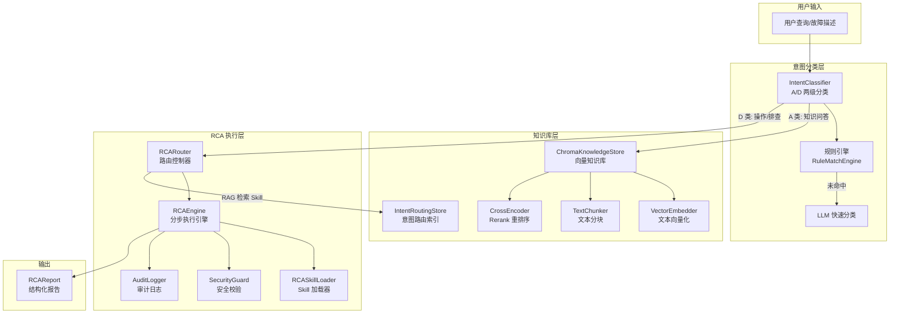
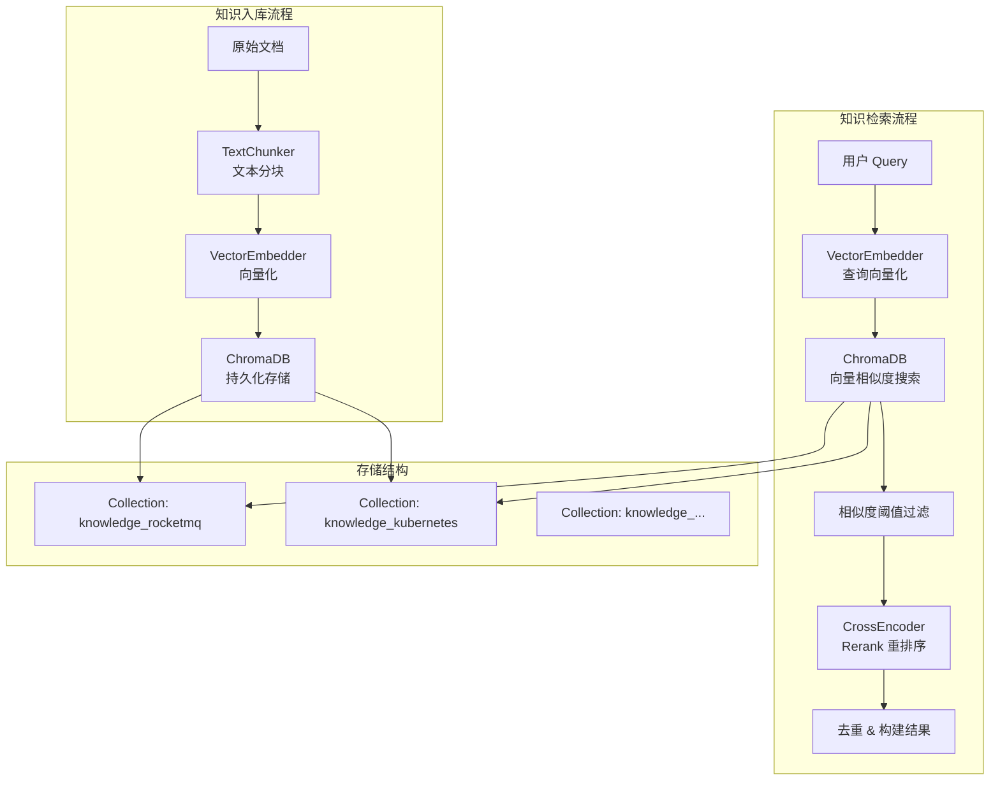
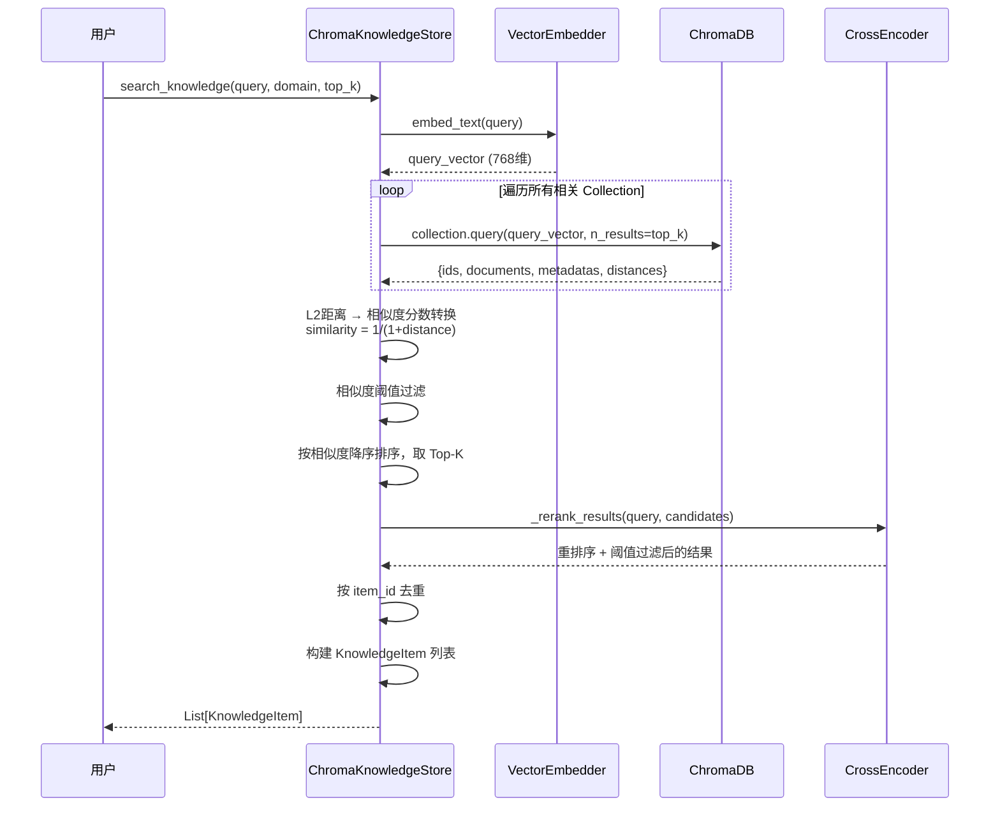
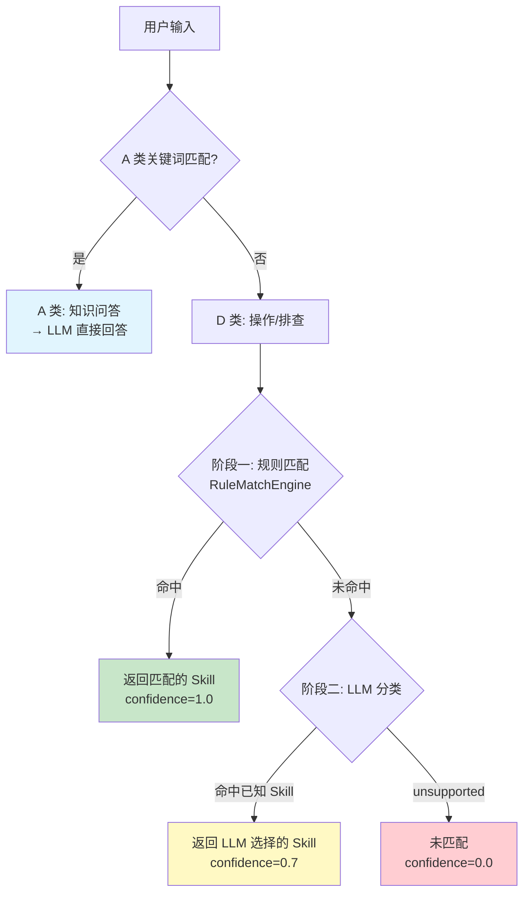
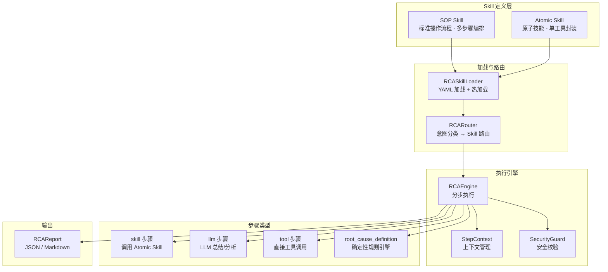
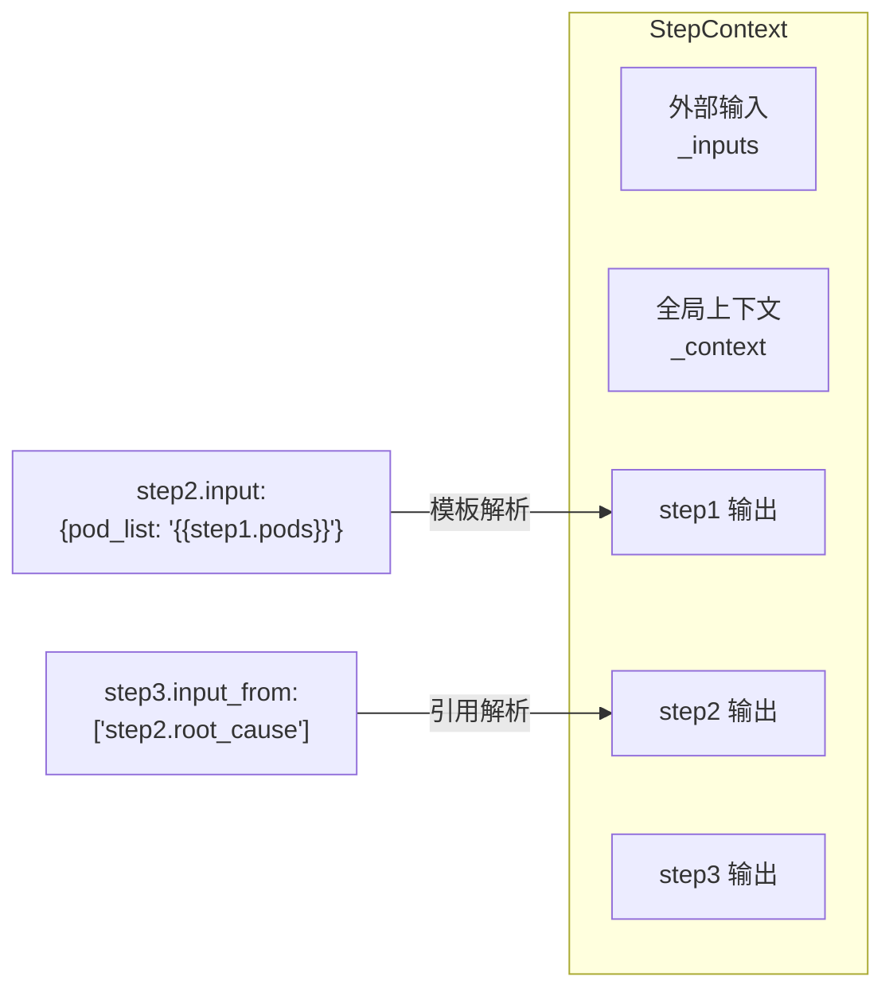
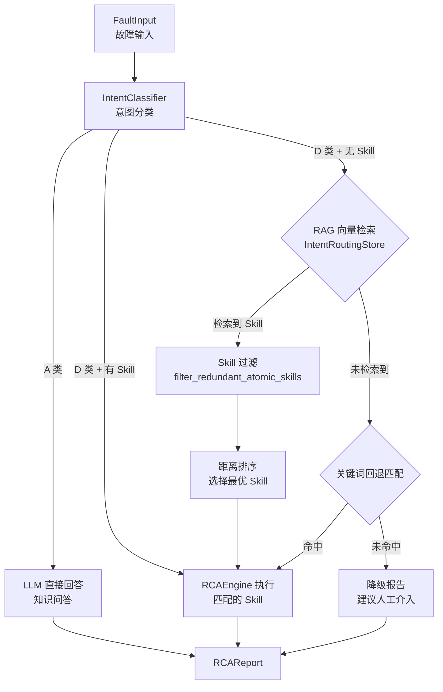
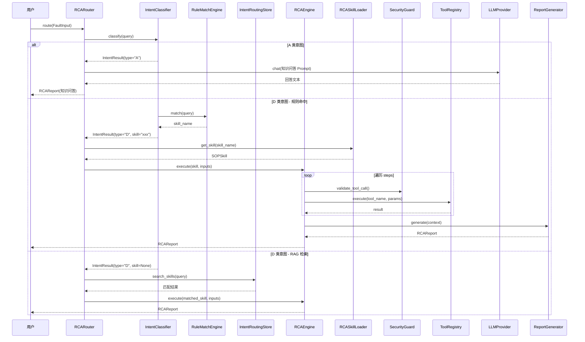
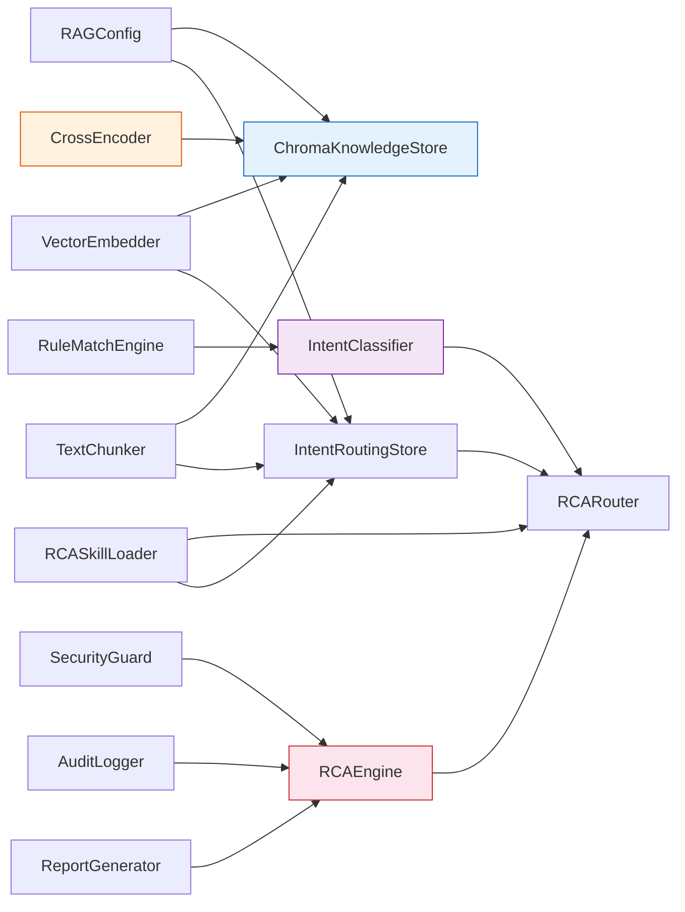

# Aether (nanobot) 项目实现文档

> Aether 是一个面向**资源受限边缘 AI 环境**的超轻量级个人 AI 助手，核心代码仅约 3,500 行。本文档重点介绍项目中 **Rerank 重排序**、**知识库系统**、**意图分类**和 **RCA 根因分析**四大核心模块的设计与实现。

---

## 目录

- [1. 整体架构概览](#1-整体架构概览)
- [2. Rerank 重排序系统](#2-rerank-重排序系统)
- [3. 知识库系统 (RAG Knowledge Base)](#3-知识库系统-rag-knowledge-base)
- [4. 意图分类系统](#4-意图分类系统)
- [5. RCA 根因分析引擎](#5-rca-根因分析引擎)
- [6. 模块协作关系](#6-模块协作关系)

---

## 1. 整体架构概览



项目采用**分层架构**，各模块职责清晰：

| 层级 | 核心模块 | 职责 |
|------|---------|------|
| **意图分类层** | `IntentClassifier`, `RuleMatchEngine` | 判断用户意图类型，路由到对应处理流程 |
| **知识库层** | `ChromaKnowledgeStore`, `VectorEmbedder`, `CrossEncoder` | 知识存储、语义检索、结果重排序 |
| **RCA 执行层** | `RCAEngine`, `RCARouter`, `RCASkillLoader` | Skill 编排执行、根因分析、报告生成 |

---

## 2. Rerank 重排序系统

### 2.1 设计目标

在 RAG 检索场景中，向量相似度搜索（Embedding + L2 距离）虽然能快速召回候选文档，但**召回精度有限**。Rerank 系统通过引入 **CrossEncoder 交叉编码器**对初步检索结果进行二次精排，显著提升最终返回结果的相关性。

### 2.2 技术方案


### 2.3 核心实现

Rerank 功能实现在 `nanobot/knowledge/store.py` 的 `ChromaKnowledgeStore` 类中：

**模型初始化** (`_init_cross_encoder`)：
- 使用 `sentence_transformers.CrossEncoder` 加载本地重排序模型
- 模型路径通过 `RAGConfig.rerank_model_path` 配置
- 自动检测 CUDA 可用性，优先使用 GPU 加速
- 模型初始化失败会**终止服务启动**，确保不会在无 Rerank 能力时提供降级服务

**重排序流程** (`_rerank_results`)：

```python
# 核心流程伪代码
def _rerank_results(query, results):
    # 1. 构建 Query-Document 对
    pairs = [(query, result['document']) for result in results]

    # 2. CrossEncoder 打分（原始分数通常在 -10 ~ 10 之间）
    scores = cross_encoder.predict(pairs)

    # 3. Sigmoid 归一化到百分制 (0-100)
    scaled_scores = [1 / (1 + exp(-score)) * 100 for score in scores]

    # 4. 阈值过滤（默认 60 分）
    filtered = [r for r, s in zip(results, scaled_scores) if s >= threshold]

    # 5. 按重排序分数降序排列
    return sorted(filtered, key=lambda x: x['rerank_score'], reverse=True)
```

### 2.4 配置参数

| 参数 | 配置项 | 默认值 | 说明 |
|------|--------|--------|------|
| 模型路径 | `rerank_model_path` | `""` | CrossEncoder 本地模型路径 |
| 重排序阈值 | `rerank_threshold` | `0.8` (配置) / `60.0` (运行时百分制) | 低于阈值的结果将被过滤 |
| 最大输入长度 | `max_length` | `512` | CrossEncoder 输入文本最大 token 数 |

### 2.5 监控指标

系统通过 Prometheus 指标 `RERANK_DURATION` 记录每次重排序的耗时和状态（`success` / `error`），便于性能监控和告警。

---

## 3. 知识库系统 (RAG Knowledge Base)

### 3.1 系统架构



### 3.2 核心组件

#### 3.2.1 ChromaKnowledgeStore（知识库存储核心）

**文件位置**：`nanobot/knowledge/store.py`

这是整个知识库系统的核心类，基于 **ChromaDB** 向量数据库实现，提供完整的知识 CRUD 和语义检索能力。

**核心能力**：

| 能力 | 方法 | 说明 |
|------|------|------|
| 知识入库 | `add_knowledge()` | 文本分块 → 向量化 → 批量存储到 Chroma |
| 语义检索 | `search_knowledge(query=...)` | 向量相似度搜索 + Rerank 重排序 |
| 元数据过滤 | `search_knowledge(domain=..., category=...)` | 基于领域/分类/标签的精确过滤 |
| 知识更新 | `update_knowledge()` | 删除旧向量 → 重新分块向量化 → 存储 |
| 知识删除 | `delete_knowledge()` | 删除所有关联的向量分块 |
| 知识导出 | `export_knowledge()` | 按 item_id 分组合并分块，导出 JSON |

**数据模型** (`KnowledgeItem`)：

```python
@dataclass
class KnowledgeItem:
    id: str              # 唯一标识 (格式: {domain}_{timestamp})
    domain: str          # 领域 (如 "rocketmq", "kubernetes")
    category: str        # 分类 (如 "troubleshooting", "configuration")
    title: str           # 标题
    content: str         # 内容
    tags: List[str]      # 标签列表
    source: str          # 来源 ("user" / "system")
    priority: int        # 优先级 (1-5)
    source_url: str      # 原文档链接
    file_path: str       # 本地文件路径
    preview_available: bool  # 是否可预览
```

#### 3.2.2 VectorEmbedder（文本向量化器）

**文件位置**：`nanobot/knowledge/vector_embedder.py`

基于 `sentence-transformers` 库实现本地文本向量化，**无需外部 API 调用**：

- 使用 `SentenceTransformer` 加载本地 Embedding 模型（如 `BAAI/bge-large-zh-v1.5`）
- 支持单文本 (`embed_text`) 和批量 (`embed_batch`) 向量化
- 空文本自动返回零向量，保证系统健壮性
- 模型加载失败抛出 `EmbeddingModelError`，提供详细的排查指引

#### 3.2.3 TextChunker（文本分块器）

**文件位置**：`nanobot/knowledge/text_chunker.py`

基于 `langchain_text_splitters.RecursiveCharacterTextSplitter` 实现智能文本分块：

**分隔符优先级**（从高到低）：

```
CHUNK_BOUNDARY（手动标记）> 代码块 > 段落(\n\n) > 中文句号/问号/感叹号
> 英文句号/问号 > 中文逗号 > 英文逗号 > 空格 > 字符级分割
```

**关键特性**：
- 支持 `CHUNK_BOUNDARY` 手动分块标记，允许精确控制分块边界
- 中文友好的分隔符配置，优先在语义完整的边界处分块
- 自动过滤内容过少（< 10 字符）的碎片分块
- 短文本（≤ chunk_size）不分块，直接返回

#### 3.2.4 IntentRoutingStore（意图路由向量索引）

**文件位置**：`nanobot/knowledge/intent_routing_store.py`

独立于知识库的向量索引系统，专门用于 **工具和 Skill 的意图路由检索**：

| 索引类型 | Collection 名称 | 数据来源 | 用途 |
|---------|----------------|---------|------|
| 工具索引 | `ops_tools` | ToolRegistry + MCP Server | 根据用户意图匹配最相关的工具 |
| Skill 索引 | `skills` | RCASkillLoader 加载的 YAML Skill | 根据故障描述匹配最相关的排障 Skill |

**MCP 工具发现**：支持通过 SSE 协议动态从 MCP Server 拉取工具列表，自动向量化入库。

### 3.3 检索流程详解

语义检索的完整流程（`search_knowledge` 方法）：



### 3.4 配置体系

所有 RAG 相关配置集中在 `RAGConfig` 数据类中（`nanobot/knowledge/rag_config.py`），支持环境变量和配置文件两种方式：

| 配置项 | 环境变量 | 默认值 | 说明 |
|--------|---------|--------|------|
| `embedding_model` | `NANOBOT_EMBEDDING_MODEL` | `""` | Embedding 模型名称/路径 |
| `chunk_size` | `NANOBOT_CHUNK_SIZE` | `500` | 分块大小（字符数） |
| `chunk_overlap` | `NANOBOT_CHUNK_OVERLAP` | `100` | 分块重叠大小 |
| `top_k` | `NANOBOT_TOP_K` | `5` | 检索返回结果数 |
| `similarity_threshold` | `NANOBOT_SIMILARITY_THRESHOLD` | `0.0` | 最低相似度阈值 |
| `rerank_model_path` | `NANOBOT_RERANK_MODEL_PATH` | `""` | Rerank 模型路径 |
| `rerank_threshold` | `NANOBOT_RERANK_THRESHOLD` | `0.8` | Rerank 过滤阈值 |

---

## 4. 意图分类系统

### 4.1 设计理念

意图分类系统采用 **A/D 两级分类** + **两阶段匹配**的设计：

- **A 类（知识问答）**：纯知识性问题，交由 LLM 直接回答
- **D 类（操作/排查请求）**：需要执行具体操作的请求，进入 Skill 执行流程



### 4.2 A 类意图识别

通过**关键词模式匹配**快速识别知识问答类请求：

```python
_A_CLASS_PATTERNS = [
    "是什么", "什么是", "介绍一下", "解释一下",
    "有什么区别", "原理", "概念", "怎么理解",
    "what is", "explain", "describe", "definition",
    "difference between",
]
```

匹配逻辑简单高效：遍历关键词列表，任一关键词出现在用户查询中即判定为 A 类。

### 4.3 D 类意图 — 阶段一：规则匹配

**文件位置**：`nanobot/rca/rule_engine.py`

`RuleMatchEngine` 是一个轻量级的正则匹配引擎：

- **配置化规则**：规则以 `{skill_name: [regex_pattern, ...]}` 格式配置，无需修改代码
- **毫秒级响应**：预编译正则表达式，匹配速度极快
- **动态管理**：支持运行时 `add_rule` / `remove_rules`

```python
# 规则配置示例
rules_config = {
    "check_pod_status": ["查看.*pod", "pod.*状态", "pod.*running"],
    "check_disk_usage": ["磁盘.*满", "disk.*full", "空间不足"],
}
```

### 4.4 D 类意图 — 阶段二：LLM 分类

当规则匹配未命中时，回退到 LLM 快速分类：

1. 将所有已注册的 Skill 名称列表构建为 Prompt
2. 让 LLM 从列表中选择最匹配的 Skill，或返回 `"unsupported"`
3. 对 LLM 返回结果进行精确匹配和忽略大小写匹配校验

**关键约束**：LLM 在此阶段**仅用于分类**，不参与执行、不生成步骤、不推理根因。

### 4.5 分类结果数据结构

```python
@dataclass
class IntentResult:
    intent_type: str        # "A"（知识问答）或 "D"（操作/排查）
    skill_name: str | None  # 匹配到的 Skill 名称（仅 D 类有值）
    match_method: str | None  # "rule" / "llm" / None
    confidence: float       # 置信度 (0.0 ~ 1.0)
```

### 4.6 监控指标

通过 `RCA_INTENT_CLASSIFY_TOTAL` Prometheus 指标按 `method` 标签（`rule` / `llm`）统计分类次数，便于分析规则覆盖率和 LLM 回退频率。

---

## 5. RCA 根因分析引擎

### 5.1 整体设计

RCA（Root Cause Analysis）引擎是 Aether 的核心排障能力，采用 **Skill 编排 + 分步执行** 的架构：



### 5.2 Skill 类型体系

#### Atomic Skill（原子技能）

对**单次工具调用**的结构化封装，本身不包含业务逻辑：

```yaml
# 示例：check_disk_usage.yaml
name: check_disk_usage
version: "1.0"
type: atomic
description: "检查磁盘使用率"
input_schema:
  node_name: string
output_schema:
  disk_usage: number
  mount_point: string
execution:
  steps:
    - tool: check_disk_usage  # 绑定 ToolRegistry 中的工具
```

#### SOP Skill（标准操作流程）

编排多个 Atomic Skill + 规则引擎 + LLM 总结的**完整排障工作流**：

```yaml
# 示例：disk_full_diagnosis.yaml
name: disk_full_diagnosis
version: "1.0"
type: sop
description: "磁盘满故障诊断"
input_schema:
  node_name: string
steps:
  - id: check_disk
    type: skill
    skill: check_disk_usage
    input:
      node_name: "{{node_name}}"

  - id: determine_cause
    type: root_cause_definition
    logic:
      - when: { disk_usage: ">90" }
        root_cause: "磁盘使用率超过 90%"
        solution: "清理日志文件或扩容磁盘"

  - id: summary
    type: llm
    prompt: "根据检查结果生成诊断报告..."
    input_from:
      - check_disk.disk_usage
      - determine_cause.root_cause
```

### 5.3 执行引擎 (RCAEngine)

**文件位置**：`nanobot/rca/engine.py`

RCAEngine 按 Skill YAML 中定义的 steps 列表**顺序执行**排障工作流：

#### 四种步骤类型的执行逻辑

| 步骤类型 | 执行方式 | 说明 |
|---------|---------|------|
| `skill` | 查找 Atomic Skill → 解析输入 → 安全校验 → ToolRegistry 执行 → 校验输出 | 通过 Atomic Skill 间接调用工具 |
| `tool` | 解析输入 → 安全校验 → ToolRegistry 直接执行 | 直接调用 ToolRegistry 中的工具 |
| `llm` | 解析引用 → 渲染 Prompt → 单轮 SLM 调用 → 解析 JSON 输出 | 独立的 LLM 调用，最小上下文 |
| `root_cause_definition` | 收集前置步骤输出 → 遍历规则 → 条件匹配 → 输出根因和建议 | 确定性规则引擎，不依赖 LLM |

#### 步骤间数据传递

通过 `StepContext` 管理步骤间的数据流：



**两种引用方式**：
- `input` 模板映射：`{"key": "{{stepId.field}}"}`，支持混合文本
- `input_from` 直接引用：`["step_id.field_name"]`，保持原始类型

**变量查找优先级**：`extra_vars` > `_inputs`（外部输入）> `_context`（全局上下文）

### 5.4 路由控制器 (RCARouter)

**文件位置**：`nanobot/rca/router.py`

RCARouter 集成意图分类器，实现完整的请求路由：



**Skill 过滤机制**（`skill_filter.py`）：当 RAG 检索同时返回 SOP Skill 和其内部引用的 Atomic Skill 时，自动移除冗余的 Atomic Skill，避免重复执行。

### 5.5 安全校验层 (SecurityGuard)

**文件位置**：`nanobot/rca/security.py`

所有工具调用和命令执行都经过双重安全校验：

| 校验类型 | 机制 | 说明 |
|---------|------|------|
| **工具白名单** | `DEFAULT_WHITELIST` + 动态扩展 | 只允许白名单内的工具执行 |
| **命令黑名单** | 预编译正则模式匹配 | 拦截 `rm -rf`、`shutdown`、`fork bomb` 等危险命令 |

### 5.6 Skill 加载与热加载

**文件位置**：`nanobot/rca/loader.py`

`RCASkillLoader` 负责 Skill 的全生命周期管理：

1. **启动加载**：递归扫描 Skill 目录，加载所有 `.yaml` / `.yml` 文件
2. **格式校验**：通过 `parser.py` 进行严格的 YAML 结构校验
3. **类型区分**：按 `type` 字段自动区分 Atomic / SOP Skill
4. **RAG 注册**：加载成功后自动注册到 `IntentRoutingStore` 向量索引
5. **热加载**：基于 `watchdog` 库监听文件系统变更，支持运行时新增/修改/删除 Skill

### 5.7 报告生成

**文件位置**：`nanobot/rca/report.py`

`RCAReport` 支持 **JSON** 和 **Markdown** 两种输出格式：

- **故障摘要**：从 LLM 总结步骤的 `summary` 字段提取
- **根因判断**：从 `root_cause_definition` 步骤或 LLM 步骤提取
- **置信度**：基于执行步骤的成功率计算（`成功步骤数 / 总步骤数`）
- **执行轨迹**：记录每个步骤的 ID、类型、状态和耗时
- **修复建议**：从 `solution` 和 `recommendation` 字段汇总

---

## 6. 模块协作关系

### 6.1 完整请求处理流程



### 6.2 核心模块依赖关系



### 6.3 Prometheus 监控指标汇总

| 指标名称 | 类型 | 标签 | 说明 |
|---------|------|------|------|
| `RAG_QUERY_DURATION` | Histogram | operation, domain, status | 向量搜索耗时 |
| `RAG_EMBEDDING_DURATION` | Histogram | operation | 向量化耗时 |
| `RAG_QUERY_RESULTS_COUNT` | Histogram | operation, domain | 检索结果数量 |
| `RAG_QUERY_TOTAL` | Counter | operation, domain, status | 检索总次数 |
| `RERANK_DURATION` | Histogram | status | Rerank 重排序耗时 |
| `RCA_EXECUTION_DURATION` | Histogram | skill_name, status | RCA 执行总耗时 |
| `RCA_STEP_DURATION` | Histogram | step_type, status | 单步骤执行耗时 |
| `RCA_EXECUTION_TOTAL` | Counter | skill_name, status | RCA 执行总次数 |
| `RCA_INTENT_CLASSIFY_TOTAL` | Counter | method | 意图分类次数 |
| `RCA_SKILL_MATCH_TOTAL` | Counter | matched | Skill 匹配次数 |
| `RCA_SECURITY_REJECT_TOTAL` | Counter | tool_name | 安全拒绝次数 |

---

> **总结**：Aether 通过 **RAG 知识库 + CrossEncoder Rerank** 提供高精度的语义检索能力，通过 **A/D 两级意图分类** 实现智能请求路由，通过 **Skill 编排 + 分步执行引擎** 实现自动化根因分析。各模块松耦合、可配置、可监控，适合在资源受限的边缘环境中部署运行。
