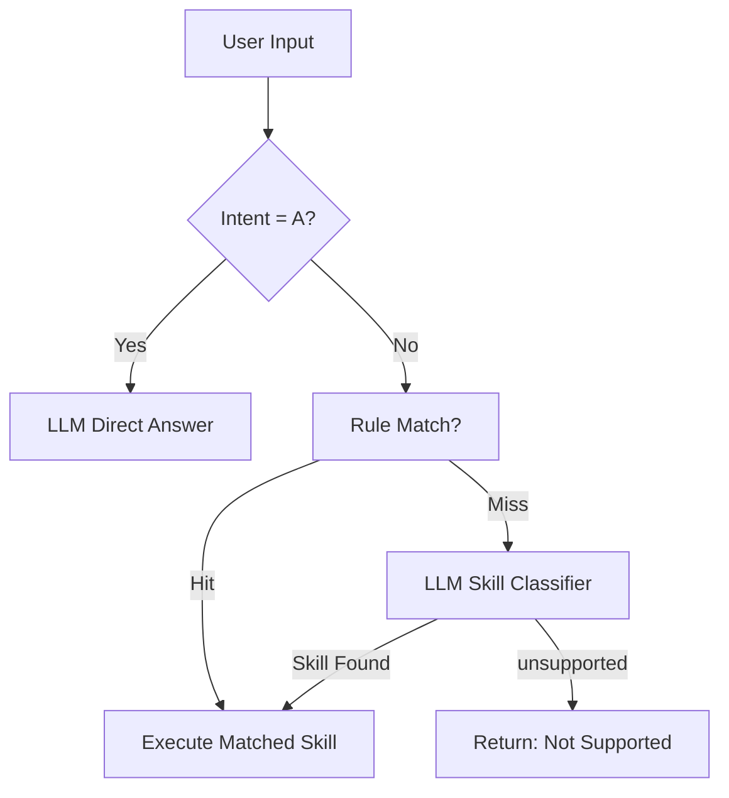

# 技术设计文档：根因分析（RCA）支持

## 文档信息

| 项目 | 内容 |
|------|------|
| 项目名称 | Aether/Nanobot RCA 支持 |
| 版本 | 2.0 |
| 创建日期 | 2026-03-18 |
| 更新日期 | 2026-03-20 |
| 状态 | 草稿 |
| 依赖需求文档 | [requirements.md](requirements.md) |

---

## 1. 概述

### 1.1 设计目标

在现有 Nanobot 框架基础上，构建一套基于 SLM + Agent 的确定性运维执行框架。核心思路：

- **仅处理 SLM 能可靠支持的问题**
- **所有操作必须对应一个明确的 Skill**
- **避免模糊推理、探索式交互、多级 fallback**
- **执行路径确定、可预测、低延迟**

> ✅ **没有 Skill = 不处理**

### 1.2 核心设计原则

1. **确定性执行**：排障流程由 YAML Skill 定义，引擎按步骤调度，无回退、无升级、无探索循环
2. **两级意图识别**：规则匹配（优先，毫秒级）→ LLM 分类（备用，仅选 Skill）
3. **两类 Skill**：Atomic Skill（原子数据采集）+ SOP Skill（流程编排）
4. **LLM 使用边界**：LLM 仅用于 A 类问答和 D 类 Skill 选择，不参与执行/推理/步骤生成
5. **显式数据流**：步骤间数据传递必须显式声明，禁止隐式上下文共享
6. **分层架构**：Tool 层无业务逻辑，Skill 层封装语义，LLM 只选择 Skill

### 1.3 分层架构设计

#### 三层职责划分

```
┌─────────────────────────────────────────────────────────────────┐
│                        LLM/SLM 层                                │
│                                                                  │
│   职责：意图识别（A/D 分类）→ Skill 选择                         │
│   方式：规则匹配（优先）→ LLM 分类（备用）                       │
│   输出：选中的 Skill + 提取的用户参数                            │
│                                                                  │
│   ❌ 不做：决定 Tool 调用、构造 Tool 参数、推理根因              │
└─────────────────────────────────────────────────────────────────┘
                              │
                              ▼
┌─────────────────────────────────────────────────────────────────┐
│                        Skill 层                                  │
│                                                                  │
│   Atomic Skill：单次工具调用 + 结构化输出（output_schema 固定）  │
│   SOP Skill：编排 Atomic Skill + LLM 总结 + 规则引擎             │
│   - 通过 root_cause_definition 实现确定性根因判断                 │
│   - 定义 output_schema 声明业务输出格式                          │
│                                                                  │
│   ✅ 包含：业务逻辑、参数模板、规则引擎、输出定义                 │
└─────────────────────────────────────────────────────────────────┘
                              │
                              ▼
┌─────────────────────────────────────────────────────────────────┐
│                        Tool 层                                   │
│                                                                  │
│   职责：数据采集 + 基础操作                                      │
│   ❌ 不做：业务判断、语义理解、异常诊断                          │
│   ✅ 只做：返回原始数据，不做任何加工                            │
└─────────────────────────────────────────────────────────────────┘
```

#### 设计原则收益

| 原则 | 收益 |
|------|------|
| Tool 层无业务逻辑 | Tool 可跨场景复用、单元测试简单、不依赖业务上下文 |
| Skill 层封装语义 | 业务逻辑集中管理、可版本控制、可审计 |
| LLM 只选 Skill | 确定性执行、减少幻觉、可预测的 Token 消耗 |

### 1.4 与现有系统的关系

```
现有 Nanobot 框架                         新增 RCA 模块
┌────────────────────────┐              ┌──────────────────────────┐
│  AgentLoop             │              │  RCA Engine              │
│  ├── ContextBuilder    │              │  ├── IntentClassifier    │
│  ├── ToolRegistry      │◄─── 复用 ───│  ├── RuleMatchEngine     │
│  ├── SubagentManager   │              │  ├── StepExecutor        │
│  └── SessionManager    │              │  └── ReportGenerator     │
├────────────────────────┤              ├──────────────────────────┤
│  Skills (Markdown)     │              │  RCA Skills (YAML)       │
│  ├── SkillsLoader      │◄─── 扩展 ───│  ├── AtomicSkillLoader   │
│  └── SKILL*.md         │              │  ├── SOPSkillLoader      │
│                        │              │  └── *.yaml              │
├────────────────────────┤              ├──────────────────────────┤
│  Knowledge (RAG)       │              │  Skill RAG 索引          │
│  ├── ChromaKnowledgeStore│◄── 复用 ──│  └── Skill 向量检索      │
│  └── IntentRoutingStore│              │                          │
├────────────────────────┤              ├──────────────────────────┤
│  Providers (LiteLLM)   │◄─── 复用 ───│  SLM 推理调用            │
│  └── LLMProvider       │              │  （仅用于 A 类 + 分类）   │
└────────────────────────┘              └──────────────────────────┘
```

---

## 2. 意图识别与执行模式设计（对应需求 1）

### 2.1 两级意图分类



> 🚫 **无回退、无升级、无探索循环**。若无法匹配 Skill，直接拒绝。

### 2.2 IntentClassifier 设计

```python
# nanobot/rca/intent.py

class IntentClassifier:
    """
    两级意图分类器
    
    阶段一：规则匹配（毫秒级）
    阶段二：LLM 快速分类（备用）
    """
    
    def __init__(self,
                 rules: dict[str, list[str]],    # skill_name -> [regex_patterns]
                 provider: LLMProvider,
                 skill_names: list[str],          # 所有已注册的 Skill 名称
                 model: str | None = None):
        self.rules = rules
        self.provider = provider
        self.skill_names = skill_names
        self.model = model
    
    def classify(self, query: str) -> IntentResult:
        """
        意图分类
        
        Returns:
            IntentResult:
                - intent_type: "A" | "D"
                - skill_name: str | None  (D 类才有)
                - match_method: "rule" | "llm" | None
        """
    
    def _rule_match(self, query: str) -> str | None:
        """阶段一：正则规则匹配，返回 skill_name 或 None"""
    
    async def _llm_classify(self, query: str) -> str | None:
        """阶段二：LLM 分类，返回 skill_name 或 None"""
```

### 2.3 规则匹配引擎

```python
# nanobot/rca/rule_engine.py

class RuleMatchEngine:
    """
    轻量级规则匹配引擎
    
    使用关键词/正则快速匹配已知 Skill。
    支持配置化新增规则，无需修改代码。
    """
    
    def __init__(self):
        self._rules: dict[str, list[re.Pattern]] = {}
    
    def load_rules(self, rules_config: dict[str, list[str]]) -> None:
        """加载规则配置"""
        for skill_name, patterns in rules_config.items():
            self._rules[skill_name] = [re.compile(p, re.IGNORECASE) for p in patterns]
    
    def match(self, query: str) -> str | None:
        """
        匹配查询到 Skill
        
        Returns:
            skill_name or None
        """
        for skill_name, patterns in self._rules.items():
            for pattern in patterns:
                if pattern.search(query):
                    return skill_name
        return None
```

### 2.4 LLM 分类 Prompt 设计

```python
LLM_CLASSIFY_PROMPT = """你是一个运维助手，请从以下技能中选择最匹配的一项：
{skill_list}

如果都不匹配，回答 "unsupported"。
只输出技能名称或 "unsupported"，不要输出其他内容。

用户问题："{query}"
"""
```

> ✅ LLM 仅用于分类，不参与执行、不生成步骤、不推理根因。

---

## 3. Skill 格式与数据模型设计（对应需求 2）

### 3.1 Skill 类型体系

```
Skill
├── Atomic Skill (type: atomic)
│   ├── 单次工具调用
│   ├── 无业务逻辑
│   ├── output_schema 必需
│   └── 命名: get_xxx, fetch_xxx
│
└── SOP Skill (type: sop)
    ├── 编排多个 Atomic Skill
    ├── 使用 root_cause_definition 进行规则判断
    ├── LLM 仅用于总结
    └── 命名: check_xxx, diagnose_xxx
```

### 3.2 Skill YAML Schema 定义

```python
# nanobot/rca/schema.py

from dataclasses import dataclass, field
from typing import Any
from enum import Enum


class SkillType(str, Enum):
    """Skill 类型枚举"""
    ATOMIC = "atomic"
    SOP = "sop"


class StepType(str, Enum):
    """SOP Skill 步骤类型枚举"""
    SKILL = "skill"           # 调用 Atomic Skill
    LLM = "llm"              # LLM 总结（仅用于总结/报告）
    TOOL = "tool"            # 直接工具调用（必要时）
    ROOT_CAUSE_DEFINITION = "root_cause_definition"  # 确定性规则引擎


@dataclass
class OutputSchema:
    """输出字段定义"""
    fields: dict[str, str]  # {field_name: type_string}


@dataclass
class RootCauseRule:
    """根因匹配规则"""
    when: dict[str, str]
    root_cause: str
    solution: str


@dataclass
class SkillStep:
    """SOP Skill 执行步骤"""
    id: str
    type: StepType
    # skill 类型专用
    skill: str | None = None                       # 调用的 Atomic Skill 名称
    # llm 类型专用
    prompt: str | None = None                      # LLM 提示词模板
    # tool 类型专用
    tool: str | None = None                        # 工具名称
    # 通用字段
    input: dict[str, Any] | None = None            # 输入参数（支持 {{}} 模板）
    input_from: list[str] | None = None            # 简单引用模式
    output_schema: OutputSchema | None = None       # 输出字段声明
    logic: list[RootCauseRule] | None = None        # 根因规则


@dataclass
class AtomicSkill:
    """Atomic Skill 定义"""
    name: str
    version: str
    description: str
    type: str = "atomic"
    input_schema: dict[str, str] = field(default_factory=dict)
    output_schema: dict[str, str] = field(default_factory=dict)  # 必需！
    # 运行时元数据
    file_path: str | None = None
    loaded_at: str | None = None


@dataclass
class SOPSkill:
    """SOP Skill 定义"""
    name: str
    version: str
    description: str
    type: str = "sop"
    input_schema: dict[str, str] = field(default_factory=dict)
    steps: list[SkillStep] = field(default_factory=list)
    # 运行时元数据
    file_path: str | None = None
    loaded_at: str | None = None
```

### 3.3 校验规则

| 校验项 | Atomic Skill | SOP Skill | 错误级别 |
|--------|-------------|-----------|----------|
| `name`, `version`, `description`, `type` | 必需 | 必需 | ERROR |
| `output_schema` 非空 | **必需** | 可选（步骤级定义） | ERROR |
| `steps` 列表 | 无 | **必需** | ERROR |
| 步骤 ID 唯一性 | - | 所有步骤 `id` 不重复 | ERROR |
| 步骤类型合法性 | - | `skill/llm/tool/root_cause_definition` | ERROR |
| `skill` 步骤需指定 `skill` 字段 | - | 必需 | ERROR |
| `llm` 步骤需指定 `prompt` 字段 | - | 必需 | ERROR |
| `input_from` / `input` 引用有效性 | - | `step_id` 指向前置步骤 | ERROR |
| `input` 模板变量一致性 | - | `{{变量名}}` 可解析 | WARNING |

### 3.4 SOP 内部数据流设计

#### 三种数据引用模式

**模式1：简单传递（input_from）**
```yaml
- id: step2
  input_from:
    - step1.pods
```

**模式2：模板映射（推荐，可解耦字段名）**
```yaml
- id: step2
  input:
    pod_list: "{{step1.pods}}"   # 下游可按需命名
```

**模式3：多输入**
```yaml
- id: step3
  input:
    pods: "{{step1.pods}}"
    metrics: "{{step2.metrics}}"
```

> 📌 `get_pods.pods` = "调用 ID 为 `get_pods` 的步骤，取其 `pods` 字段"
> 这是**强绑定、静态可验证**的数据引用方式。

---

## 4. 系统架构（对应需求 3）

### 4.1 整体架构图

```
                          ┌──────────────┐
                          │  用户请求输入  │
                          └──────┬───────┘
                                 │
                    ┌────────────▼───────────┐
                    │   意图分类器            │
                    │   (IntentClassifier)   │
                    │   ┌─────────────────┐  │
                    │   │ A/D 意图分类     │  │
                    │   └────────┬────────┘  │
                    │            │            │
                    │   ┌────────▼────────┐  │
                    │   │ A类→LLM直接回答  │  │
                    │   │ D类→Skill执行    │  │
                    │   └────────┬────────┘  │
                    └────────────┼───────────┘
                                 │ (D类)
                    ┌────────────▼───────────┐
                    │   Skill 路由            │
                    │   ┌─────────────────┐  │
                    │   │ 阶段一:规则匹配  │  │
                    │   │ 阶段二:LLM分类   │  │
                    │   └────────┬────────┘  │
                    └────────────┼───────────┘
                                 │
                    ┌────────────▼───────────┐
                    │   执行引擎              │
                    │   (RCAEngine)          │
                    │                        │
                    │   ┌──────────────────┐  │
                    │   │  Skill 解析器     │  │
                    │   │  (SkillParser)   │  │
                    │   └────────┬─────────┘  │
                    │            │             │
                    │   ┌────────▼─────────┐  │
                    │   │  步骤执行器       │  │
                    │   │  (StepExecutor)  │  │
                    │   │  ┌─────────────┐ │  │
                    │   │  │ Skill Step  │ │  │
                    │   │  │ LLM Step    │ │  │
                    │   │  │ Tool Step   │ │  │
                    │   │  │ RCD Step    │ │  │
                    │   │  └─────────────┘ │  │
                    │   └────────┬─────────┘  │
                    │            │             │
                    │   ┌────────▼─────────┐  │
                    │   │  安全校验层       │  │
                    │   │  (SecurityGuard) │  │
                    │   └────────┬─────────┘  │
                    │            │             │
                    │   ┌────────▼─────────┐  │
                    │   │  报告生成器       │  │
                    │   │  (ReportGenerator)│  │
                    │   └──────────────────┘  │
                    └─────────────────────────┘
                                 │
                    ┌────────────▼───────────┐
                    │   输出: RCA 报告        │
                    │   - JSON 结构化格式     │
                    │   - Markdown 可读格式   │
                    └────────────────────────┘
```

### 4.2 模块职责一览

| 模块 | 职责 | 新增/复用 |
|------|------|-----------|
| `IntentClassifier` | A/D 意图分类 | 新增 |
| `RuleMatchEngine` | 规则匹配引擎（阶段一） | 新增 |
| `RCASkillLoader` | 加载、校验、热更新 YAML Skill（区分 Atomic/SOP） | 新增 |
| `SkillParser` | 解析 YAML Skill 为可执行步骤序列 | 新增 |
| `StepExecutor` | 按步骤类型（skill/llm/tool/rcd）执行 | 新增 |
| `RCAEngine` | 编排整体执行流程，管理步骤上下文 | 新增 |
| `SecurityGuard` | 命令白名单校验 | 新增 |
| `ReportGenerator` | 生成 JSON / Markdown 格式 RCA 报告 | 新增 |
| `AuditLogger` | 记录执行轨迹与审计日志 | 新增 |
| `ToolRegistry` | 注册和执行工具调用 | 复用 |
| `LLMProvider` | SLM 推理调用（仅 A 类 + 分类 + 总结步骤） | 复用 |
| `IntentRoutingStore` | Skill 向量检索 | 复用扩展 |

---

## 5. 详细设计

### 5.1 Skill 加载与管理（对应需求 4）

#### 5.1.1 RCASkillLoader 设计

```python
# nanobot/rca/loader.py

class RCASkillLoader:
    """
    RCA Skill 文件加载器
    
    职责：
    1. 从指定目录加载 YAML Skill 文件
    2. 区分 Atomic Skill 和 SOP Skill
    3. 格式校验与解析
    4. 文件变更监听与热加载
    5. 注册到规则匹配引擎和 RAG 向量库
    """
    
    def __init__(self, skill_dir: Path, intent_routing_store=None):
        self.skill_dir = skill_dir
        self._atomic_skills: dict[str, AtomicSkill] = {}
        self._sop_skills: dict[str, SOPSkill] = {}
        self._watcher = None
    
    def load_all(self) -> int:
        """加载目录中所有 YAML Skill 文件"""
    
    def load_file(self, path: Path) -> AtomicSkill | SOPSkill | None:
        """加载并校验单个 YAML 文件，按 type 字段区分类型"""
    
    def get_atomic_skill(self, name: str) -> AtomicSkill | None:
        """获取 Atomic Skill（用于 SOP 步骤调用时查找 output_schema）"""
    
    def get_sop_skill(self, name: str) -> SOPSkill | None:
        """获取 SOP Skill"""
    
    def list_skills(self) -> list[dict]:
        """列出所有 Skill，包含 type、skill_name、output_schema"""
```

#### 5.1.2 热加载机制

```
文件系统事件
    │
    ├── 新增 .yaml ──→ load_file() ──→ validate() ──→ 成功: 按类型注册
    ├── 修改 .yaml ──→ load_file() ──→ validate() ──→ 成功: 更新
    └── 删除 .yaml ──→ 从内存和 RAG 中移除
```

#### 5.1.3 Skill 目录结构

```
~/.nanobot/workspace/skills/
├── rocketmq/
│   ├── SKILL-Atomic01-get_pods.yaml
│   ├── SKILL-Atomic02-get_logs.yaml
│   ├── SKILL-Sop01-check_pod_health.yaml
│   └── SKILL-Sop02-analyze_logs.yaml
└── kubernetes/
    ├── SKILL-Atomic01-get_nodes.yaml
    └── SKILL-Sop01-diagnose_crash.yaml
```

### 5.2 分步执行引擎（对应需求 3）

#### 5.2.1 RCAEngine 核心流程

```python
# nanobot/rca/engine.py

class RCAEngine:
    """
    RCA 分步执行引擎
    
    按 SOP Skill 中 steps 列表顺序逐步执行。
    Atomic Skill 作为 skill 类型步骤被调用。
    """
    
    def __init__(self, provider, tool_registry, security_guard,
                 audit_logger, skill_loader, model=None):
        self.provider = provider
        self.tools = tool_registry
        self.security = security_guard
        self.audit = audit_logger
        self.skill_loader = skill_loader  # 用于查找 Atomic Skill
        self.model = model
    
    async def execute(self, skill: SOPSkill, inputs: dict,
                      stream_callback=None) -> RCAReport:
        """执行完整的 SOP Skill 工作流"""
```

#### 5.2.2 执行流程时序图

```
┌──────┐  ┌───────────┐  ┌──────────┐  ┌───────────┐  ┌──────────┐
│Client│  │IntentClass │  │RCAEngine │  │StepExecutor│  │LLMProvider│
└──┬───┘  └─────┬─────┘  └────┬─────┘  └─────┬─────┘  └────┬─────┘
   │            │              │               │              │
   │ 用户请求   │              │               │              │
   │───────────>│              │               │              │
   │            │ A/D 分类     │               │              │
   │            │──┐           │               │              │
   │            │<─┘           │               │              │
   │            │              │               │              │
   │            │ D类:规则匹配 │               │              │
   │            │──────────────>               │              │
   │            │              │ 初始化上下文    │              │
   │            │              │───────────────>│              │
   │            │              │                │              │
   │            │              │ ── Step 1: skill ──           │
   │            │              │                │ 查找AtomicSkill│
   │            │              │                │ 解析input模板  │
   │            │              │                │ 查找绑定Tool   │
   │            │              │                │ 调用ToolRegistry
   │            │              │                │──────┐       │
   │            │              │                │<─────┘       │
   │            │              │                │ 按output_schema
   │            │              │                │ 收集输出      │
   │            │              │                │              │
   │            │              │ ── Step 2: skill ──           │
   │            │              │                │ 调用另一个     │
   │            │              │                │ AtomicSkill   │
   │            │              │                │──────┐       │
   │            │              │                │<─────┘       │
   │            │              │                │              │
   │            │              │ ── Step 3: llm (总结) ──      │
   │            │              │                │ 构建prompt    │
   │            │              │                │─────────────>│
   │            │              │                │ SLM返回       │
   │            │              │                │<─────────────│
   │            │              │                │              │
   │            │              │ 生成RCA报告     │              │
   │            │              │<───────────────│              │
   │ 返回报告   │              │                │              │
   │<───────────│──────────────│                │              │
```

#### 5.2.3 步骤上下文管理

```python
# nanobot/rca/context.py

class StepContext:
    """
    步骤执行上下文
    
    管理各步骤的输出数据，支持 input_from 和 {{}} 模板引用解析。
    """
    
    def __init__(self, inputs: dict):
        self._inputs = inputs              # 外部输入 (input_schema)
        self._outputs: dict[str, dict] = {}  # step_id -> {field: value}
        self._traces: list[StepTrace] = []
    
    def set_output(self, step_id: str, output: dict) -> None:
        """存储步骤输出"""
    
    def resolve_input_from(self, refs: list[str]) -> dict:
        """解析 input_from 引用：["step_id.field_name"] → {field_name: value}"""
    
    def resolve_input_template(self, input_map: dict) -> dict:
        """
        解析 input 模板映射
        
        {"pod_list": "{{step1.pods}}"} → {"pod_list": actual_value}
        支持 {{stepId.fieldName}} 和 {{inputParam}} 两种格式
        """
    
    def resolve_template(self, template: str, extra_vars: dict = None) -> str:
        """渲染 prompt 模板，替换 {{变量名}}"""
```

#### 5.2.4 四种步骤类型的执行逻辑

**Skill 步骤执行**（调用 Atomic Skill）：

> 📌 **Atomic Skill 底层执行路径**是 SOP Skill 编排的核心环节。Atomic Skill 本身不直接执行任何逻辑，
> 它本质上是对 **Tool 层工具调用的结构化封装**，通过 `output_schema` 约束输出格式，
> 通过 `input_schema` 约束输入参数，实现 Tool → Skill 的语义升级。

```python
async def _execute_skill_step(self, step: SkillStep, ctx: StepContext) -> dict:
    """
    执行 skill 类型步骤 —— Atomic Skill 的完整执行路径
    
    执行流程：
    ┌──────────────────────────────────────────────────────────────┐
    │ 1. 查找 Atomic Skill 定义                                    │
    │    skill_loader.get_atomic_skill(step.skill)                │
    │    → 获取 AtomicSkill 对象（含 input_schema, output_schema） │
    │    → 若找不到，抛出 SkillNotFoundError                       │
    │                                                              │
    │ 2. 解析输入参数                                               │
    │    ctx.resolve_input_template(step.input)                   │
    │    → 将 {{stepId.field}} 替换为实际值                         │
    │    → 校验参数是否满足 Atomic Skill 的 input_schema            │
    │                                                              │
    │ 3. 查找绑定的 Tool                                           │
    │    通过 Atomic Skill 的 name 映射到 ToolRegistry 中的工具     │
    │    映射规则：skill.name → tool_registry[skill.name]          │
    │    → 若找不到绑定 Tool，抛出 ToolNotFoundError               │
    │                                                              │
    │ 4. 安全校验                                                   │
    │    security_guard.validate_tool_call(tool_name, params)     │
    │    → 白名单检查，拒绝则终止                                   │
    │                                                              │
    │ 5. 执行 Tool 调用                                            │
    │    tool_registry.execute(tool_name, resolved_input)          │
    │    → 获取工具原始返回数据                                     │
    │                                                              │
    │ 6. 按 output_schema 提取并校验输出                            │
    │    遍历 atomic.output_schema 中声明的字段名                   │
    │    从 Tool 原始返回中提取对应字段                              │
    │    → 缺失字段记录 WARNING，填充 None                          │
    │    → 多余字段丢弃（仅保留 output_schema 声明的字段）          │
    │                                                              │
    │ 7. 存入 StepContext                                          │
    │    ctx.set_output(step.id, validated_output)                 │
    │    → 后续步骤可通过 {{step_id.field}} 引用这些输出            │
    └──────────────────────────────────────────────────────────────┘
    """
    # Step 1: 查找 Atomic Skill 定义
    atomic = self.skill_loader.get_atomic_skill(step.skill)
    if atomic is None:
        raise SkillNotFoundError(f"Atomic Skill '{step.skill}' not found")
    
    # Step 2: 解析输入参数（模板替换）
    resolved_input = ctx.resolve_input_template(step.input or {})
    
    # Step 3: 执行 Atomic Skill（底层调用 Tool）
    result = await self._call_atomic_skill(atomic, resolved_input)
    
    # Step 4: 按 output_schema 校验输出
    validated = self._validate_output(result, atomic.output_schema)
    
    # Step 5: 存入上下文
    ctx.set_output(step.id, validated)
    return validated


async def _call_atomic_skill(self, atomic: AtomicSkill, params: dict) -> dict:
    """
    Atomic Skill 底层执行 —— 通过 ToolRegistry 调用绑定的工具
    
    Atomic Skill 与 Tool 的关系：
    ┌───────────────────┐          ┌───────────────────┐
    │   Atomic Skill    │          │      Tool         │
    │                   │  绑定    │                   │
    │  name: get_pods   │────────> │  name: get_pods   │
    │  input_schema:    │          │  execute(params)  │
    │    namespace: str  │          │  → 原始数据返回    │
    │    component: str  │          │                   │
    │  output_schema:   │          └───────────────────┘
    │    pods: list     │
    │    total: int     │
    └───────────────────┘
    
    绑定规则：Atomic Skill 的 name 作为 key，
    在 ToolRegistry 中查找同名工具。
    
    这意味着：
    - 每个 Atomic Skill 必须有一个同名的 Tool 注册
    - Tool 只负责数据采集，返回原始数据
    - Atomic Skill 通过 output_schema 约束 Tool 返回的数据格式
    - Atomic Skill 不包含任何业务逻辑（不过滤、不判断、不转换）
    """
    tool_name = atomic.name  # Atomic Skill name = Tool name
    
    # 安全校验
    self.security.validate_tool_call(tool_name, params)
    
    # 通过 ToolRegistry 执行工具调用
    raw_result = await self.tools.execute(tool_name, params)
    
    return raw_result


def _validate_output(self, raw: dict, output_schema: dict[str, str]) -> dict:
    """
    按 output_schema 提取并校验输出字段
    
    - 仅保留 output_schema 中声明的字段（丢弃多余字段）
    - 缺失字段填充 None 并记录 WARNING
    - 确保输出结构与 output_schema 一致
    """
    validated = {}
    for field_name, field_type in output_schema.items():
        if field_name in raw:
            validated[field_name] = raw[field_name]
        else:
            validated[field_name] = None
            logger.warning(f"Output field '{field_name}' missing from tool result")
    return validated
```

> ⚠️ **关键设计决策**：Atomic Skill 不是一个独立的执行器，而是 Tool 调用的**声明式封装**。
> 它的核心价值在于：
> 1. **输入约束**：通过 `input_schema` 声明需要哪些参数，引擎自动从 `{{}}` 模板解析
> 2. **输出约束**：通过 `output_schema` 固定输出字段名，供下游步骤引用
> 3. **可发现性**：注册到 RAG 向量库，支持意图匹配和前端下拉展示
> 4. **与 Tool 的映射**：`skill.name` = `tool.name`，一一对应

**LLM 步骤执行**（仅用于总结/报告）：

```python
async def _execute_llm_step(self, step: SkillStep, ctx: StepContext) -> dict:
    """
    执行 llm 类型步骤（仅用于总结/报告生成）
    
    1. 解析 input 模板 / input_from
    2. 渲染 prompt 模板
    3. 构建最小上下文消息（仅当前 prompt）
    4. 调用 LLMProvider.chat() 单轮推理
    5. 解析 JSON 并校验 output_schema
    """
    extra_vars = {}
    if step.input:
        extra_vars = ctx.resolve_input_template(step.input)
    elif step.input_from:
        extra_vars = ctx.resolve_input_from(step.input_from)
    
    prompt = ctx.resolve_template(step.prompt, extra_vars)
    
    messages = [
        {"role": "system", "content": "你是运维诊断助手，严格按 JSON 格式输出。"},
        {"role": "user", "content": prompt}
    ]
    
    response = await self.provider.chat(messages=messages, model=self.model)
    output = self._parse_json_output(response.content)
    ctx.set_output(step.id, output)
    return output
```

**Tool 步骤执行**：

```python
async def _execute_tool_step(self, step: SkillStep, ctx: StepContext) -> dict:
    """
    执行 tool 类型步骤
    
    1. 安全校验（白名单检查）
    2. 通过 ToolRegistry 执行工具调用
    3. 按 output_schema 存入 StepContext
    """
    self.security.validate_tool_call(step.tool, step.input)
    resolved_input = ctx.resolve_input_template(step.input or {})
    result = await self.tools.execute(step.tool, resolved_input)
    ctx.set_output(step.id, result)
    return result
```

**Root Cause Definition 步骤执行**：

```python
async def _execute_rcd_step(self, step: SkillStep, ctx: StepContext) -> dict:
    """
    执行 root_cause_definition 类型步骤
    
    遍历 logic 规则列表，匹配条件后输出 root_cause + solution
    """
    for rule in step.logic:
        if self._match_rule(rule.when, ctx):
            output = {"root_cause": rule.root_cause, "solution": rule.solution}
            ctx.set_output(step.id, output)
            return output
    
    output = {"root_cause": "未能匹配到已知根因", "solution": "建议人工介入排查"}
    ctx.set_output(step.id, output)
    return output
```

### 5.3 安全性与审计（对应需求 7）

#### 5.3.1 SecurityGuard 设计

```python
# nanobot/rca/security.py

class SecurityGuard:
    """安全校验层"""
    
    DEFAULT_WHITELIST = {
        "check_disk_usage", "check_memory", "check_cpu",
        "kubectl_get_pods", "kubectl_query_log", "knowledge_search",
    }
    
    BLACKLIST_PATTERNS = [
        r"rm\s+(-rf?|--recursive)", r"shutdown", r"reboot",
        r"mkfs", r"dd\s+if=", r":\(\)\{",
    ]
    
    def validate_tool_call(self, tool_name: str, params: dict = None) -> None:
        """校验工具调用安全性"""
    
    def validate_command(self, command: str) -> None:
        """校验 Shell 命令安全性"""
```

#### 5.3.2 AuditLogger 设计

```python
# nanobot/rca/audit.py

class AuditLogger:
    """审计日志记录器，JSON Lines 格式持久化"""
    
    def log_step(self, session_id, step_id, step_type,
                 command, input_data, output_data, status, duration): ...
    def log_security_event(self, session_id, event_type, details): ...
    def get_session_log(self, session_id) -> list[dict]: ...
```

### 5.4 RCA 报告生成

```python
@dataclass
class RCAReport:
    """RCA 报告"""
    fault_summary: str
    root_cause: str
    confidence: float
    execution_traces: list[StepTrace]
    recommendations: list[str]
    skill_name: str | None = None
    skill_version: str | None = None
    start_time: float = 0
    end_time: float = 0
    
    def to_json(self) -> str: ...
    def to_markdown(self) -> str: ...
```

---

## 6. 错误处理策略

| 错误类型 | 处理策略 | 说明 |
|----------|----------|------|
| Atomic Skill 调用失败 | 标记步骤 error，终止 | 记录工具名和错误 |
| Atomic Skill 未找到 | 立即终止 | skill_loader 中无对应 Atomic Skill |
| Atomic Skill 绑定 Tool 缺失 | 立即终止 | ToolRegistry 中无同名 Tool |
| output_schema 字段缺失 | WARNING + 填充 None，继续执行 | Tool 返回数据不完整 |
| LLM 调用超时 | 重试 1 次，仍失败终止 | 记录超时快照 |
| LLM 输出格式错误 | 重试 1 次（附加格式约束），仍失败终止 | JSON 解析失败 |
| 安全校验拒绝 | 立即终止，通知操作人员 | 记录到审计日志 |
| input 引用缺失 | 终止 | 前置步骤输出不完整 |
| 规则未命中 | 使用默认回退，继续执行 | "未能匹配到已知根因" |
| 意图识别失败 | 返回"不支持" | 无回退，直接拒绝 |

---

## 7. 性能设计（对应需求 6）

| 优化点 | 实现方案 | 预期效果 |
|--------|----------|----------|
| 规则匹配优先 | D 类请求先走正则匹配，毫秒级响应 | 减少 LLM 调用次数 |
| 最小上下文注入 | LLM 步骤仅注入 prompt + input 引用数据 | Token 消耗减少 80%+ |
| Atomic Skill 无 LLM | Atomic Skill 通过 ToolRegistry 直接调用工具，不经过 LLM | CPU 级延迟 |
| Skill 内存缓存 | 加载后缓存到内存字典 | 零延迟获取 |
| 热加载隔离 | 后台线程处理变更，不阻塞执行中任务 | 零停机更新 |

---

## 8. 新增代码目录结构

```
nanobot/
├── rca/                          # 新增 RCA 模块
│   ├── __init__.py
│   ├── schema.py                 # Skill 数据模型（AtomicSkill + SOPSkill）
│   ├── parser.py                 # YAML 解析与校验
│   ├── loader.py                 # Skill 加载器（区分 Atomic/SOP）
│   ├── intent.py                 # 意图分类器（A/D 分类）
│   ├── rule_engine.py            # 规则匹配引擎
│   ├── context.py                # 步骤上下文管理（含 {{}} 模板解析）
│   ├── engine.py                 # 分步执行引擎（4种步骤类型）
│   ├── security.py               # 安全校验层（工具白名单 + 命令黑名单）
│   ├── audit.py                  # 审计日志
│   ├── report.py                 # 报告生成器
│   └── evaluator.py              # 根因规则匹配器
├── agent/
│   └── tools/
│       └── rca_trigger.py        # RCA 触发工具
└── knowledge/
    └── intent_routing_store.py   # 扩展: RCA Skill 索引
```

---

## 9. 配置扩展

```yaml
# config.yaml
rca:
  enabled: true
  skill_dir: "~/.nanobot/workspace/skills"
  model: "ollama/qwen2.5:7b"
  hot_reload: true
  max_step_timeout: 30
  max_total_timeout: 300
  intent_rules:                    # 规则匹配配置
    check_pod_status:
      - "查看.*pod"
      - "pod.*状态"
      - "list.*broker"
    diagnose_timeout:
      - "timeout"
      - "超时"
      - "连接失败"
  security_whitelist:
    - "check_rocketmq_status"
  audit_log_dir: "~/.nanobot/workspace/rca_audit"
```

---

## 10. 附录

### 10.1 关键依赖

| 依赖 | 版本 | 用途 |
|------|------|------|
| `pyyaml` | >=6.0 | YAML 文件解析 |
| `watchdog` | >=3.0 | 文件系统监听（热加载） |
| `chromadb` | 已有 | 向量数据库（RAG） |
| `litellm` | 已有 | 多 LLM Provider 统一接入 |

### 10.2 Prometheus 指标扩展

| 指标名 | 类型 | 说明 |
|--------|------|------|
| `aether_rca_execution_duration_seconds` | Histogram | RCA 完整执行耗时 |
| `aether_rca_step_duration_seconds` | Histogram | 单步骤执行耗时（按类型标签） |
| `aether_rca_execution_total` | Counter | 执行总次数（按状态标签） |
| `aether_rca_intent_classify_total` | Counter | 意图分类次数（按方法标签：rule/llm） |
| `aether_rca_security_reject_total` | Counter | 安全拒绝次数 |
