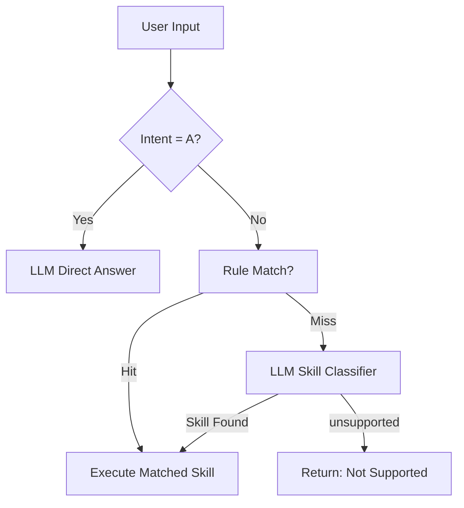

# 需求文档：根因分析（RCA）支持

## 引言

### 背景

传统基于大语言模型（LLM）的 Agent 在根因分析（RCA）中表现出强大的推理能力，但存在高延迟、高成本及隐私风险。本项目旨在在现有 Aether/Nanobot 框架基础上，构建一套基于小语言模型（SLM）+ Agent 架构的智能运维系统，通过引入结构化的 Skill（技能）机制和确定性执行路径，在保证低延迟和低成本的前提下，实现高效的自动化故障诊断与根因分析。

### 目标

- **仅处理 SLM 能可靠支持的问题**
- **所有操作必须对应一个明确的 Skill**
- **避免模糊推理、探索式交互、多级 fallback**
- **执行路径确定、可预测、低延迟**

> ✅ **核心原则**：**没有 Skill = 不处理**。不尝试"猜"用户意图，也不做"尽力而为"的探索。

### 与现有系统的关系

本功能在现有 Nanobot 框架（`nanobot/agent/`、`nanobot/skills/`、`nanobot/knowledge/`）基础上扩展，新增：
- 结构化 RCA Skill 格式（YAML），分为 Atomic Skill 和 SOP Skill 两类
- 两阶段意图识别与执行引擎（规则匹配 + LLM 分类）
- Skill 加载与管理（支持 YAML 格式热加载）
- RCA 报告生成能力

---

## 需求 1：意图识别与执行模式

**用户故事：** 作为运维系统，我希望能快速准确地识别用户意图并路由到对应的处理方式，以便实现确定性的执行路径。

### 1.1 意图分类（A/D 两级）

#### 验收标准

1. WHEN 用户输入请求时 THEN 系统 SHALL 将意图分为两类：
   - **A 类（知识问答）**：如"RocketMQ 是什么？" → 交由 LLM 直接回答
   - **D 类（操作/排查请求）**：如"查 broker 状态" → 进入 Skill 执行流程

2. WHEN 系统识别意图时 THEN 系统 SHALL 不再区分 B/C/D1/D2/D3 等子类型，仅保留 A / D 两类。

### 1.2 两阶段执行模式

#### 验收标准

1. **阶段一：规则匹配（优先）**
   - WHEN 接收到 D 类请求时 THEN 系统 SHALL 首先使用轻量关键词/正则规则快速匹配已知 Skill
   - WHEN 规则命中时 THEN 系统 SHALL 直接调用对应 Skill，跳过 LLM 分类
   - 规则配置示例：
     ```python
     RULES = {
         "check_pod_status": ["查看.*pod", "pod.*状态", "list.*broker"],
         "diagnose_timeout": ["timeout", "超时", "连接失败"],
         "check_message_lag": ["积压", "lag", "消费慢"]
     }
     ```

2. **阶段二：LLM 快速意图分类（备用）**
   - WHEN 规则匹配未命中时 THEN 系统 SHALL 将用户 Query 提交给 LLM，从预定义的 Skill 列表中选择最匹配的一项（或返回 `"unsupported"`）
   - WHEN LLM 返回 `"unsupported"` 时 THEN 系统 SHALL 直接返回"不支持该操作"，**不做任何回退或探索**
   - LLM 在此阶段 **仅用于分类**，不参与执行、不生成步骤、不推理根因

---

## 需求 2：结构化 RCA Skill 格式定义

**用户故事：** 作为一名运维工程师，我希望能够以结构化 YAML 格式定义排障 Skill，Skill 分为两类：Atomic Skill（原子技能）和 SOP Skill（标准操作流程技能），以便系统能精准执行。

### 2.1 Atomic Skill（原子技能）格式

#### 验收标准

1. WHEN 运维工程师创建 Atomic Skill 时 THEN 系统 SHALL 支持以下 YAML 结构：
   - 顶层 `skill` 节点包含：`name`、`version`、`description`、`type`（值为 `atomic`）、`input_schema`、`output_schema`
   - `output_schema` 为必需字段，定义输出字段名及类型
   - 字段名必须稳定、不可变（`pods` 就是 `pods`，不能有时叫 `pod_list`）

2. WHEN Atomic Skill 执行时 THEN 系统 SHALL 执行单次工具调用获取原始数据，无业务逻辑。

3. Atomic Skill 命名规范：`get_xxx`、`fetch_xxx`。

#### 示例

```yaml
skill:
  name: get_rocketmq_pods
  version: "1.0"
  description: 获取 RocketMQ 相关 Pod 列表
  type: atomic
  input_schema:
    namespace: string
    component: string
  output_schema:
    pods: list      # ← 字段名固定为 "pods"，永不变更
    total: int
```

### 2.2 SOP Skill（标准操作流程技能）格式

#### 验收标准

1. WHEN 运维工程师创建 SOP Skill 时 THEN 系统 SHALL 支持以下 YAML 结构：
   - 顶层 `skill` 节点包含：`name`、`version`、`description`、`type`（值为 `sop`）、`input_schema`、`steps`
   - `steps` 为步骤列表，每个步骤包含 `id`（唯一标识）、`type`（步骤类型）

2. WHEN 定义步骤类型时 THEN 系统 SHALL 支持以下类型：
   - `skill`：调用 Atomic Skill，需指定 `skill` 字段和 `input` 参数
   - `llm`：调用 LLM 生成总结/报告（仅用于总结，不用于推理根因）
   - `tool`：直接调用工具（如有必要）
   - `root_cause_definition`：规则引擎做确定性根因判断

   > ⚠️ **当前版本不支持 `python` 步骤类型**。数据分析和判断逻辑通过 `root_cause_definition` 规则引擎或 `tool` 步骤实现。Python 代码执行能力将在后续版本中引入。

3. WHEN 定义步骤间数据传递时 THEN 系统 SHALL 支持两种数据引用模式：
   - **input_from 模式**（简单传递）：`input_from: [step1.pods]`
   - **input 模板映射模式**（推荐，可解耦字段名）：`input: { pod_list: "{{step1.pods}}" }`

4. WHEN SOP Skill 需要根因判断时 THEN 系统 SHALL 使用 `root_cause_definition` 步骤完成，**禁止依赖 LLM 推理根因**。

5. WHEN SOP Skill 需要生成最终报告时 THEN 系统 SHALL 支持在末尾使用 `type: llm` 的总结步骤和 `type: tool` 的结束步骤。

6. WHEN 系统加载 Skill 文件时 THEN 系统 SHALL 支持热加载，无需重启服务即可生效。

#### 示例

```yaml
skill:
  name: diagnose_timeout
  version: "1.0"
  description: 诊断 RocketMQ 超时问题
  type: sop
  input_schema:
    namespace: string
    component: string
  steps:
    - id: get_pods
      type: skill
      skill: get_rocketmq_pods
      input:
        namespace: "{{namespace}}"
        component: "{{component}}"

    - id: analyze
      type: root_cause_definition
      input:
        pods: "{{get_pods.pods}}"
      logic:
        - when:
            has_abnormal_pods: "true"
          root_cause: "存在异常 Pod，可能因资源不足或配置错误导致"
          solution: "检查 Pod 事件日志，确认资源配额和镜像配置"
        - when:
            all_pods_running: "true"
          root_cause: "所有 Pod 运行正常"
          solution: "无需处理"
      output_schema:
        root_cause: string
        solution: string

    - id: conclusion
      type: llm
      input:
        pods: "{{get_pods.pods}}"
        root_cause: "{{analyze.root_cause}}"
        solution: "{{analyze.solution}}"
      prompt: |
        根据诊断结果生成分析报告...
      output_schema:
        summary: string
        root_cause: string
        recommendation: string
        priority: string
```

### 2.3 SOP Skill 内部数据流规范

#### 验收标准

1. WHEN 定义步骤间数据传递时 THEN 数据流必须"显式"声明：
   - `stepA.output → stepB.input` 必须明确声明，禁止隐式上下文共享

2. WHEN 定义输出字段时 THEN 字段名必须"稳定"：
   - `pods` 就是 `pods`，不能有时叫 `pod_list`、有时叫 `items`

3. WHEN 定义输出结构时 THEN 必须通过 `output_schema` 固定结构：
   - ❌ 禁止动态字段：`output: {任意 JSON}`
   - ✅ 必须固定结构：通过 `output_schema` 声明

---

## 需求 3：基于 Skill 的分步执行引擎

**用户故事：** 作为 SLM 推理引擎，我希望按照 Skill YAML 中定义的 `steps` 列表顺序，逐步执行排障工作流，以便在不依赖长程规划能力的前提下完成多步骤故障诊断。

#### 验收标准

1. WHEN 接收到 D 类请求并匹配到 Skill 时 THEN 系统 SHALL 加载该 Skill 的 `input_schema` 绑定输入参数，并从 `steps` 列表的第一个步骤开始执行。

2. WHEN 当前步骤 `type` 为 `skill` 时 THEN 系统 SHALL 调用对应的 Atomic Skill，传入 `input` 中定义的参数（支持 `{{变量名}}` 模板替换），收集返回结果存入步骤输出上下文。

3. WHEN 当前步骤 `type` 为 `llm` 时 THEN 系统 SHALL：
   - 通过 `input` 或 `input_from` 注入前置步骤数据
   - 渲染 `prompt` 模板（替换 `{{变量名}}`）
   - 提交给 SLM 单轮推理
   - 解析返回 JSON 并校验 `output_schema`
   - **仅注入当前步骤的 prompt 和必要前置输出**，禁止一次性加载整个 Skill 文档

4. WHEN 当前步骤 `type` 为 `root_cause_definition` 时 THEN 系统 SHALL 遍历 `logic` 列表进行规则匹配（支持比较运算符如 `">90"`），命中规则输出 `root_cause` 和 `solution`。

5. WHEN `steps` 列表中的最后一个步骤执行完成时 THEN 系统 SHALL 汇总全部步骤的执行轨迹和输出，生成结构化的 RCA 报告。

6. IF 某步骤执行超时或失败 THEN 系统 SHALL 记录失败信息（步骤 ID、失败原因、上下文快照），并根据错误策略决定重试、跳过或终止。

---

## 需求 4：Skill 加载与管理

**用户故事：** 作为平台维护者，我希望系统能够加载和管理 Atomic Skill 和 SOP Skill 文件，支持热加载。

#### 验收标准

1. WHEN 系统启动或检测到 Skill 目录变更时 THEN 系统 SHALL 从指定目录加载 YAML 格式的 Skill 文件，并区分 `type: atomic` 和 `type: sop`。
2. WHEN 加载 Skill 文件时 THEN 系统 SHALL 进行格式校验（必需字段完整性、步骤结构合法性、`output_schema` 存在性等），校验失败的文件跳过并记录错误日志。
3. WHEN 新增或更新 Skill 文件时 THEN 系统 SHALL 支持热加载，无需重启服务即可生效。
4. WHEN 用户查询 Skill 列表时 THEN 系统 SHALL 提供查询接口，返回 skill_name、type（atomic/sop）、output_schema 等信息。
5. WHEN Skill 文件加载成功时 THEN 系统 SHALL 自动将其注册到规则匹配引擎和 RAG 向量库。
6. WHEN Atomic Skill 加载时 THEN 系统 SHALL 强制校验 `output_schema` 字段存在且非空。

---

## 需求 5：LLM 使用边界

**用户故事：** 作为系统架构师，我希望严格限定 LLM/SLM 在系统中的使用场景，确保执行的确定性和可预测性。

#### 验收标准

| 场景 | 允许？ | 说明 |
|------|--------|------|
| 回答知识问题（A 类） | ✅ | 自由生成 |
| 从 Skill 列表中分类（D 类） | ✅ | 仅输出 skill name 或 `"unsupported"` |
| 执行根因分析 | ❌ | 必须由 SOP Skill 内部的 root_cause_definition 步骤完成 |
| 生成执行步骤 | ❌ | 步骤在 Skill 定义中固化 |
| 总结结果 | ✅（可选） | 可在 SOP Skill 执行后调用 LLM 生成自然语言报告 |

1. WHEN SLM 用于意图分类时 THEN 系统 SHALL 仅允许 SLM 输出 skill name 或 `"unsupported"`，不允许输出执行计划、Tool 参数或推理过程。
2. WHEN SOP Skill 执行过程中使用 LLM 步骤时 THEN 该步骤 SHALL 仅用于总结/报告生成，不得用于根因推理或步骤规划。

---

## 需求 6：性能与低延迟保障

**用户故事：** 作为运维平台，我希望系统在执行根因分析时保持低延迟，满足生产环境的实时响应需求。

#### 验收标准

1. WHEN 处理 D 类请求时 THEN 系统 SHALL 优先使用规则匹配（毫秒级），仅在规则未命中时才使用 LLM 分类。
2. WHEN 执行 LLM 步骤时 THEN 系统 SHALL 仅注入当前步骤的 prompt 和必要的前置输出，减少 80%+ 的 Token 消耗。
3. WHEN 执行 Atomic Skill 和 root_cause_definition 步骤时 THEN 这些步骤 SHALL 在 CPU 上高效运行，不依赖 LLM。
4. WHEN 系统进行 Skill 检索时 THEN RAG 预筛选 SHALL 在 SLM 介入前快速锁定 Top-1 Skill。
5. IF 系统部署 SLM 时 THEN 系统 SHALL 支持接入量化模型（如 GGUF 格式），实现有限硬件资源上的高效推理。
6. WHEN 系统运行时 THEN Skill 热加载 SHALL 不影响正在执行的 RCA 任务。

---

## 需求 7：安全性与审计

**用户故事：** 作为安全合规负责人，我希望所有执行命令经过安全校验，保留完整审计日志。

#### 验收标准

1. WHEN 系统执行 Tool 调用或 Shell 命令时 THEN 系统 SHALL 进行白名单过滤，拒绝危险命令（如 `rm -rf`、`shutdown` 等）。
2. WHEN Skill 执行过程中每个步骤完成时 THEN 系统 SHALL 记录审计日志：时间戳、步骤 ID、执行命令、执行结果、SLM 输入/输出。
3. IF 命令被安全策略拒绝 THEN 系统 SHALL 记录拒绝原因并终止当前 RCA 流程。
4. WHEN 系统运行时 THEN 所有 Skill 执行轨迹 SHALL 可追溯，支持事后审计与回放。

---

## 需求 8：分层架构设计原则

**用户故事：** 作为架构师，我希望系统遵循清晰的分层设计原则，实现职责分离。

### 验收标准

1. **Tool 层不包含任何业务逻辑**
   - Tool 只负责数据采集和基础操作，不包含业务判断或语义理解
   - Tool 的输入输出为结构化的通用格式
   - 示例：`kubectl_get_pods` 只返回 Pod 列表原始数据，不判断是否健康

2. **Skill 层封装业务语义 + 规则 + 输出**
   - Atomic Skill：封装单次工具调用 + 结构化输出（`output_schema` 固定）
   - SOP Skill：编排多个 Atomic Skill + 规则引擎 + LLM 总结，实现完整业务流程
   - Skill 的 `output_schema` 定义业务需要的输出格式

3. **LLM 只选择 Skill，不参与 Tool 参数决策**
   - LLM/SLM 仅扮演"意图识别 + Skill 选择"的角色
   - Skill 选定后，Tool 调用参数由 Skill YAML 静态定义或通过 `input`/`input_from` 推导
   - LLM 不决定调用哪个 Tool、不决定 Tool 参数值

### 架构分层图

```
┌─────────────────────────────────────────────────────────────────┐
│                        LLM/SLM 层                                │
│                                                                  │
│   职责：意图识别（A/D 分类）→ Skill 选择                         │
│   方式：规则匹配（优先）→ LLM 分类（备用）                       │
│   输出：选中的 Skill + 提取的用户参数                            │
│                                                                  │
│   ❌ 不做：决定 Tool 调用、构造 Tool 参数、推理根因              │
└─────────────────────────────────────────────────────────────────┘
                              │
                              ▼
┌─────────────────────────────────────────────────────────────────┐
│                        Skill 层                                  │
│                                                                  │
│   Atomic Skill：单次工具调用 + 结构化输出                        │
│   SOP Skill：编排 Atomic Skill + 规则引擎 + LLM 总结              │
│   - 通过 root_cause_definition 实现确定性根因判断               │
│   - 定义 output_schema 声明业务输出格式                          │
│                                                                  │
│   ✅ 包含：业务逻辑、参数模板、规则引擎、输出定义                 │
└─────────────────────────────────────────────────────────────────┘
                              │
                              ▼
┌─────────────────────────────────────────────────────────────────┐
│                        Tool 层                                   │
│                                                                  │
│   职责：数据采集 + 基础操作                                      │
│   ❌ 不做：业务判断、语义理解、异常诊断                          │
│   ✅ 只做：返回原始数据，不做任何加工                            │
└─────────────────────────────────────────────────────────────────┘
```

---

## 需求 9：可扩展性

**用户故事：** 作为平台开发者，我希望系统支持插件化接入新的数据源和 Skill。

#### 验收标准

1. WHEN 新增 Skill 文件到指定目录时 THEN 系统 SHALL 自动热加载，无需重启。
2. WHEN 接入新的监控数据源时 THEN 系统 SHALL 通过 Tool 插件化接口完成集成，不修改核心引擎代码。
3. WHEN 新增 Skill 时 THEN 不影响现有 Skill 的正常执行。
4. WHEN 新增规则匹配条目时 THEN 系统 SHALL 支持配置化新增，无需修改代码。

---

## 需求 10：落地约束

#### 验收标准

1. **Skill 必须显式注册**：每个支持的问题场景，必须有对应的 Skill 实现。
2. **不支持模糊查询**：如"系统好像有问题" → 直接返回"请明确具体问题"。
3. **SLM 只负责分类**：不承担推理、规划、容错。
4. **性能优先**：规则匹配 > LLM 分类；Atomic/SOP 执行需在 CPU 上高效运行。
5. **所有 Atomic Skill 必须定义 output_schema，且字段名长期稳定**。
6. **SOP 内部数据引用必须显式、静态、可验证**。

---

## 执行流程总览



> 🚫 **无回退、无升级、无探索循环**。若无法匹配 Skill，直接拒绝。

---

## 数据流设计

```
用户请求 / 故障告警
  │
  ▼
意图识别（A/D 分类）
  │
  ├── A 类 → LLM 直接回答 → 返回
  │
  └── D 类 → 两阶段执行模式
        │
        ├── 阶段一：规则匹配 → 命中 → 执行 Skill
        │
        └── 阶段二：LLM 分类 → 匹配 → 执行 Skill
                               → unsupported → 返回"不支持"
```

---

## 附录：关键术语表

| 术语 | 说明 |
|------|------|
| SLM | Small Language Model，参数量较小（通常 <10B），专用于特定任务的高效模型 |
| Atomic Skill | 原子技能，单次工具调用获取原始数据，必须定义 output_schema |
| SOP Skill | 标准操作流程技能，编排多个 Atomic Skill + 规则 + LLM 总结 |
| RCA | Root Cause Analysis，根因分析 |
| RAG | Retrieval-Augmented Generation，检索增强生成 |
| EARS | Easy Approach to Requirements Syntax，简易需求语法格式 |
